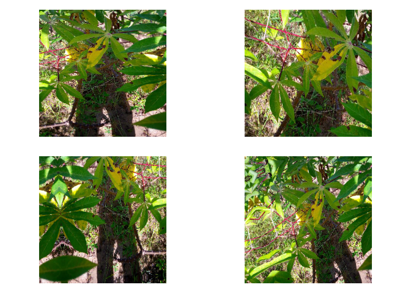
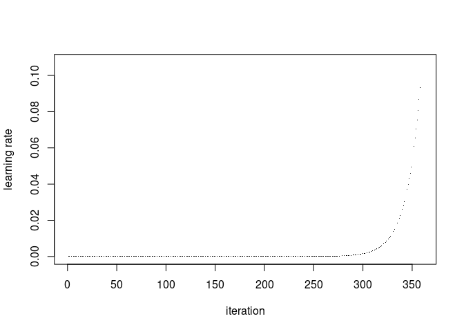
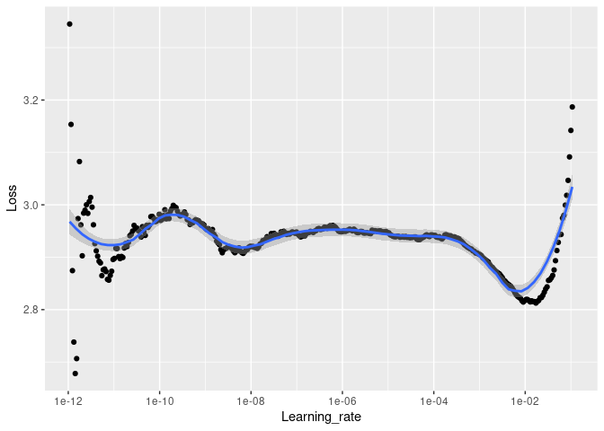
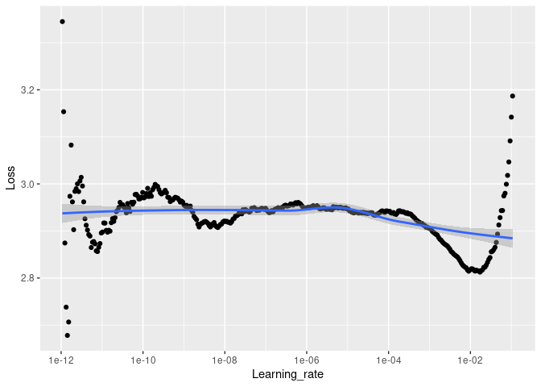

Learning rate finder
================

# Learning rate finder for the efficientnet with R

This notebook contain the learning rate finder, the code that determine
what are the maximum and minimum value of learning rate to use for the
network, instead of trying experimentally several settings and see what
work the most.

In previous competition I reimplemented a learning rate finder based on
based on the code of this
[article](http://thecooldata.com/2019/01/learning-rate-finder-with-cifar10-keras-r/),
but with some change to be closer to the lr\_finder of fast.ai, changed
inspired by this
[articles](https://sgugger.github.io/how-do-you-find-a-good-learning-rate.html).
No weighted loss here, I prefer to see the data as it is, and it is way
more easy to just plot the loess of the loss than computing an weighted
loss computed on the fly.

Most of the code came from the [notebook of this previous
competition](https://www.kaggle.com/cdk292/simple-resnet50-lr-finder-and-cyclic-lr-with-r)
on Leaf Pathology.

## Important note

The appearence of the curve of the learning rate finder depend heavily
on the size of the batch size.

## Model construction

``` r
library(tidyverse)
```

    ## ── Attaching packages ─────────────────────────────────────── tidyverse 1.3.0 ──

    ## ✓ ggplot2 3.3.2     ✓ purrr   0.3.4
    ## ✓ tibble  3.0.4     ✓ dplyr   1.0.2
    ## ✓ tidyr   1.1.2     ✓ stringr 1.4.0
    ## ✓ readr   1.4.0     ✓ forcats 0.5.0

    ## ── Conflicts ────────────────────────────────────────── tidyverse_conflicts() ──
    ## x dplyr::filter() masks stats::filter()
    ## x dplyr::lag()    masks stats::lag()

``` r
library(tensorflow)
tf$executing_eagerly()
```

    ## [1] TRUE

Application wrapper for Efficientnet are not yet pushed in the main
keras :

``` r
#devtools::install_github(repo="Cdk29/keras")
```

``` r
library(keras) #forked version with application for Resnet
#library(reticulate)
```

``` r
tensorflow::tf_version()
```

    ## [1] '2.3'

``` r
tfhub:::tfhub$version$`__version__`
```

    ## [1] "0.10.0"

``` r
labels<-read_csv('cassava-leaf-disease-classification/train.csv')
```

    ## 
    ## ── Column specification ────────────────────────────────────────────────────────
    ## cols(
    ##   image_id = col_character(),
    ##   label = col_double()
    ## )

``` r
head(labels)
```

    ## # A tibble: 6 x 2
    ##   image_id       label
    ##   <chr>          <dbl>
    ## 1 1000015157.jpg     0
    ## 2 1000201771.jpg     3
    ## 3 100042118.jpg      1
    ## 4 1000723321.jpg     1
    ## 5 1000812911.jpg     3
    ## 6 1000837476.jpg     3

``` r
levels(as.factor(labels$label))
```

    ## [1] "0" "1" "2" "3" "4"

``` r
idx0<-which(labels$label==0)
idx1<-which(labels$label==1)
idx2<-which(labels$label==2)
idx3<-which(labels$label==3)
idx4<-which(labels$label==4)
```

``` r
labels$CBB<-0
labels$CBSD<-0
labels$CGM<-0
labels$CMD<-0
labels$Healthy<-0
```

``` r
labels$CBB[idx0]<-1
labels$CBSD[idx1]<-1
labels$CGM[idx2]<-1
labels$CMD[idx3]<-1
labels$Healthy[idx4]<-1
```

``` r
labels$label<-NULL
```

``` r
head(labels)
```

    ## # A tibble: 6 x 6
    ##   image_id         CBB  CBSD   CGM   CMD Healthy
    ##   <chr>          <dbl> <dbl> <dbl> <dbl>   <dbl>
    ## 1 1000015157.jpg     1     0     0     0       0
    ## 2 1000201771.jpg     0     0     0     1       0
    ## 3 100042118.jpg      0     1     0     0       0
    ## 4 1000723321.jpg     0     1     0     0       0
    ## 5 1000812911.jpg     0     0     0     1       0
    ## 6 1000837476.jpg     0     0     0     1       0

``` r
set.seed(6)

labels <- labels  %>% mutate(id = row_number())#Check IDs

train_labels <- labels  %>% sample_frac(.90)#Create test set
val_labels <- anti_join(labels, train_labels, by = 'id')
train_labels$id<-NULL
val_labels$id<-NULL

head(train_labels)
```

    ## # A tibble: 6 x 6
    ##   image_id         CBB  CBSD   CGM   CMD Healthy
    ##   <chr>          <dbl> <dbl> <dbl> <dbl>   <dbl>
    ## 1 2244546793.jpg     0     0     0     1       0
    ## 2 4122391127.jpg     0     0     0     1       0
    ## 3 75598343.jpg       0     0     0     1       0
    ## 4 4102423093.jpg     0     0     0     1       0
    ## 5 111117998.jpg      0     0     0     1       0
    ## 6 1755522975.jpg     0     0     0     1       0

``` r
head(val_labels)
```

    ## # A tibble: 6 x 6
    ##   image_id         CBB  CBSD   CGM   CMD Healthy
    ##   <chr>          <dbl> <dbl> <dbl> <dbl>   <dbl>
    ## 1 1000812911.jpg     0     0     0     1       0
    ## 2 1001749118.jpg     0     0     0     1       0
    ## 3 1003218714.jpg     0     0     1     0       0
    ## 4 1003888281.jpg     1     0     0     0       0
    ## 5 1009037539.jpg     0     0     0     1       0
    ## 6 1009126931.jpg     0     0     0     0       1

``` r
summary(train_labels)
```

    ##    image_id              CBB               CBSD             CGM        
    ##  Length:19257       Min.   :0.00000   Min.   :0.0000   Min.   :0.0000  
    ##  Class :character   1st Qu.:0.00000   1st Qu.:0.0000   1st Qu.:0.0000  
    ##  Mode  :character   Median :0.00000   Median :0.0000   Median :0.0000  
    ##                     Mean   :0.05053   Mean   :0.1027   Mean   :0.1107  
    ##                     3rd Qu.:0.00000   3rd Qu.:0.0000   3rd Qu.:0.0000  
    ##                     Max.   :1.00000   Max.   :1.0000   Max.   :1.0000  
    ##       CMD            Healthy     
    ##  Min.   :0.0000   Min.   :0.000  
    ##  1st Qu.:0.0000   1st Qu.:0.000  
    ##  Median :1.0000   Median :0.000  
    ##  Mean   :0.6151   Mean   :0.121  
    ##  3rd Qu.:1.0000   3rd Qu.:0.000  
    ##  Max.   :1.0000   Max.   :1.000

``` r
summary(val_labels)
```

    ##    image_id              CBB               CBSD              CGM        
    ##  Length:2140        Min.   :0.00000   Min.   :0.00000   Min.   :0.0000  
    ##  Class :character   1st Qu.:0.00000   1st Qu.:0.00000   1st Qu.:0.0000  
    ##  Mode  :character   Median :0.00000   Median :0.00000   Median :0.0000  
    ##                     Mean   :0.05327   Mean   :0.09907   Mean   :0.1192  
    ##                     3rd Qu.:0.00000   3rd Qu.:0.00000   3rd Qu.:0.0000  
    ##                     Max.   :1.00000   Max.   :1.00000   Max.   :1.0000  
    ##       CMD            Healthy     
    ##  Min.   :0.0000   Min.   :0.000  
    ##  1st Qu.:0.0000   1st Qu.:0.000  
    ##  Median :1.0000   Median :0.000  
    ##  Mean   :0.6136   Mean   :0.115  
    ##  3rd Qu.:1.0000   3rd Qu.:0.000  
    ##  Max.   :1.0000   Max.   :1.000

``` r
image_path<-'cassava-leaf-disease-classification/train_images/'
```

``` r
#data augmentation
datagen <- image_data_generator(
  rotation_range = 40,
  width_shift_range = 0.2,
  height_shift_range = 0.2,
  shear_range = 0.2,
  zoom_range = 0.5,
  horizontal_flip = TRUE,
  fill_mode = "reflect"
)
```

``` r
img_path<-"cassava-leaf-disease-classification/train_images/1000015157.jpg"

img <- image_load(img_path, target_size = c(448, 448))
img_array <- image_to_array(img)
img_array <- array_reshape(img_array, c(1, 448, 448, 3))
img_array<-img_array/255
# Generated that will flow augmented images
augmentation_generator <- flow_images_from_data(
  img_array, 
  generator = datagen, 
  batch_size = 1 
)
op <- par(mfrow = c(2, 2), pty = "s", mar = c(1, 0, 1, 0))
for (i in 1:4) {
  batch <- generator_next(augmentation_generator)
  plot(as.raster(batch[1,,,]))
}
```

<!-- -->

``` r
par(op)
```

``` r
train_generator <- flow_images_from_dataframe(dataframe = train_labels, 
                                              directory = image_path,
                                              generator = datagen,
                                              class_mode = "other",
                                              x_col = "image_id",
                                              y_col = c("CBB","CBSD", "CGM", "CMD", "Healthy"),
                                              target_size = c(448, 448),
                                              batch_size=16)

validation_generator <- flow_images_from_dataframe(dataframe = val_labels, 
                                              directory = image_path,
                                              class_mode = "other",
                                              x_col = "image_id",
                                              y_col = c("CBB","CBSD", "CGM", "CMD", "Healthy"),
                                              target_size = c(448, 448),
                                              batch_size=4)
```

``` r
train_generator
```

    ## <tensorflow.python.keras.preprocessing.image.DataFrameIterator>

``` r
conv_base<-application_efficientnet_b0(weights = "imagenet", include_top = FALSE, input_shape = c(448, 448, 3))
```

``` r
freeze_weights(conv_base)
```

``` r
model <- keras_model_sequential() %>%
    conv_base %>% 
    layer_global_max_pooling_2d() %>% 
    layer_batch_normalization() %>% 
    layer_dropout(rate=0.5) %>%
    layer_dense(units=5, activation="softmax")
```

``` r
summary(model)
```

    ## Model: "sequential"
    ## ________________________________________________________________________________
    ## Layer (type)                        Output Shape                    Param #     
    ## ================================================================================
    ## efficientnetb0 (Functional)         (None, 14, 14, 1280)            4049571     
    ## ________________________________________________________________________________
    ## global_max_pooling2d (GlobalMaxPool (None, 1280)                    0           
    ## ________________________________________________________________________________
    ## batch_normalization (BatchNormaliza (None, 1280)                    5120        
    ## ________________________________________________________________________________
    ## dropout (Dropout)                   (None, 1280)                    0           
    ## ________________________________________________________________________________
    ## dense (Dense)                       (None, 5)                       6405        
    ## ================================================================================
    ## Total params: 4,061,096
    ## Trainable params: 8,965
    ## Non-trainable params: 4,052,131
    ## ________________________________________________________________________________

## Learning rate finder

``` r
LogMetrics <- R6::R6Class("LogMetrics",
  inherit = KerasCallback,
  public = list(
    loss = NULL,
    acc = NULL,
    on_batch_end = function(batch, logs=list()) {
      self$loss <- c(self$loss, logs[["loss"]])
      self$acc <- c(self$acc, logs[["acc"]])
    }
))
```

``` r
callback_lr_init <- function(logs){
      iter <<- 0
      lr_hist <<- c()
      iter_hist <<- c()
}
callback_lr_set <- function(batch, logs){
      iter <<- iter + 1
      LR <- l_rate[iter] # if number of iterations > l_rate values, make LR constant to last value
      if(is.na(LR)) LR <- l_rate[length(l_rate)]
      k_set_value(model$optimizer$lr, LR)
}
callback_lr_log <- function(batch, logs){
      lr_hist <<- c(lr_hist, k_get_value(model$optimizer$lr))
      iter_hist <<- c(iter_hist, k_get_value(model$optimizer$iterations))
}
```

``` r
callback_lr <- callback_lambda(on_train_begin=callback_lr_init, on_batch_begin=callback_lr_set)

callback_logger <- callback_lambda(on_batch_end=callback_lr_log)

callback_log_acc_lr <- LogMetrics$new()
```

### Settings

In this notebook I take advantages of the quite good computing abilities
of my laptop and set the lr0 to quite a low value. It is also important
to test for low value of learning rate decay, since a annhilation of the
gradient is also a part of the learning rate finder.

``` r
lr0<-1e-12
#lr_max<-0.01
lr_max<-0.1

#n_iteration :
n <- 360 #from 120 to 360
q<-(lr_max/lr0)^(1/(n-1))
```

\#\#\#Plot and lr finder

``` r
i<-1:n
l_rate<-lr0*(q^i) #formula from the blog article of fastai.
plot(l_rate, type="b", pch=16, cex=0.1, xlab="iteration", ylab="learning rate")
```

<!-- -->

``` r
model %>% compile(
    optimizer=optimizer_rmsprop(lr=lr_max),
    loss="categorical_crossentropy",
    metrics='categorical_accuracy'
)

callback_list = list(callback_lr, callback_logger, callback_log_acc_lr)

history <- model %>% fit_generator(
    train_generator,
    steps_per_epoch=n,
    epochs = 1,
    callbacks = callback_list,
    validation_data = validation_generator,
    validation_step=1
)
```

``` r
data <- data.frame("Learning_rate" = lr_hist, "Loss" = callback_log_acc_lr$loss)
head(data)
```

    ##   Learning_rate     Loss
    ## 1  1.073101e-12 3.345026
    ## 2  1.151546e-12 3.153471
    ## 3  1.235725e-12 2.874427
    ## 4  1.326059e-12 2.738109
    ## 5  1.422995e-12 2.678057
    ## 6  1.527017e-12 2.706529

``` r
x_breaks = 10^pretty(log10(data$Learning_rate))
ggplot(data, aes(x=Learning_rate, y=Loss)) + scale_x_log10(breaks=x_breaks) + geom_point() +  geom_smooth(span = 0.5)
```

    ## `geom_smooth()` using method = 'loess' and formula 'y ~ x'

<!-- -->

I add several smooth setting since I don’t know in advance how the
curves and dots will looks like :

``` r
ggplot(data, aes(x=Learning_rate, y=Loss)) + scale_x_log10(breaks=x_breaks) + geom_point() +  geom_smooth(span = 0.3)
```

    ## `geom_smooth()` using method = 'loess' and formula 'y ~ x'

<!-- -->

``` r
ggplot(data, aes(x=Learning_rate, y=Loss)) + scale_x_log10(breaks=x_breaks) + geom_point() +  geom_smooth(span = 0.8)
```

    ## `geom_smooth()` using method = 'loess' and formula 'y ~ x'

<!-- -->
