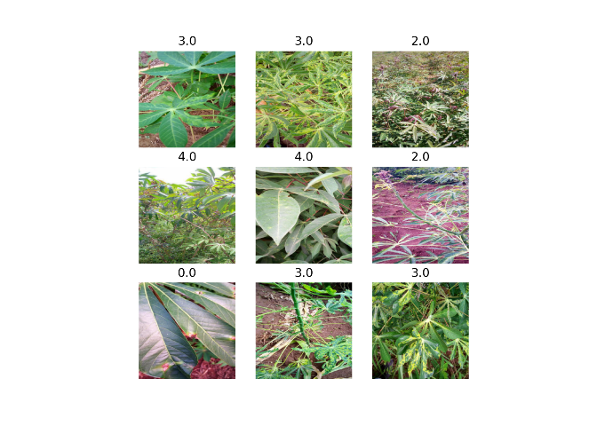

Bug export
================

# Xresnet with R

``` r
# This R environment comes with many helpful analytics packages installed
# It is defined by the kaggle/rstats Docker image: https://github.com/kaggle/docker-rstats
# For example, here's a helpful package to load

library(tidyverse) # metapackage of all tidyverse packages
```

    ## ── Attaching packages ─────────────────────────────────────── tidyverse 1.3.0 ──

    ## ✓ ggplot2 3.3.2     ✓ purrr   0.3.4
    ## ✓ tibble  3.0.4     ✓ dplyr   1.0.2
    ## ✓ tidyr   1.1.2     ✓ stringr 1.4.0
    ## ✓ readr   1.4.0     ✓ forcats 0.5.0

    ## ── Conflicts ────────────────────────────────────────── tidyverse_conflicts() ──
    ## x dplyr::filter() masks stats::filter()
    ## x dplyr::lag()    masks stats::lag()

``` r
# Input data files are available in the read-only "../input/" directory
# For example, running this (by clicking run or pressing Shift+Enter) will list all files under the input directory

list.files(path = "../input")
```

    ## character(0)

``` r
# You can write up to 20GB to the current directory (/kaggle/working/) that gets preserved as output when you create a version using "Save & Run All" 
# You can also write temporary files to /kaggle/temp/, but they won't be saved outside of the current session
```

``` r
devtools::install_github("henry090/fastai",dependencies=FALSE)
```

    ## Downloading GitHub repo henry090/fastai@HEAD

    ##      checking for file ‘/tmp/RtmpdO4umF/remotesca1f0d394c/henry090-fastai-92744cf/DESCRIPTION’ ...  ✓  checking for file ‘/tmp/RtmpdO4umF/remotesca1f0d394c/henry090-fastai-92744cf/DESCRIPTION’
    ##   ─  preparing ‘fastai’:
    ##    checking DESCRIPTION meta-information ...  ✓  checking DESCRIPTION meta-information
    ##   ─  checking for LF line-endings in source and make files and shell scripts (421ms)
    ##   ─  checking for empty or unneeded directories
    ##   ─  building ‘fastai_2.0.4.tar.gz’
    ##      
    ## 

    ## Installing package into '/home/erolland/R/x86_64-pc-linux-gnu-library/4.0'
    ## (as 'lib' is unspecified)

``` r
#fastai::install_fastai(gpu = TRUE)
```

``` r
#devtools::install_github("Rstudio/reticulate")
#fastai::install_fastai(gpu = TRUE)
```

``` r
library(fastai)
```

    ## 
    ## Attaching package: 'fastai'

    ## The following object is masked from 'package:dplyr':
    ## 
    ##     slice

    ## The following object is masked from 'package:purrr':
    ## 
    ##     partial

    ## The following object is masked from 'package:stats':
    ## 
    ##     reshape

    ## The following object is masked from 'package:graphics':
    ## 
    ##     plot

    ## The following objects are masked from 'package:grDevices':
    ## 
    ##     cm, colors, rgb2hsv

    ## The following object is masked from 'package:methods':
    ## 
    ##     show

    ## The following objects are masked from 'package:base':
    ## 
    ##     plot, Recall

### Data loader

I am using this two ressources : [the documentation of
fastai](https://docs.fast.ai/vision.data.html#ImageDataLoaders.from_df)
and the [tutorial of the
wrapper](https://henry090.github.io/fastai/articles/basic_img_class.html).

``` r
path_img = 'cassava-leaf-disease-classification/train_images/'
```

``` r
#library(data.table)
```

``` r
labels<-read_csv('cassava-leaf-disease-classification//train.csv')
```

    ## 
    ## ── Column specification ────────────────────────────────────────────────────────
    ## cols(
    ##   image_id = col_character(),
    ##   label = col_double()
    ## )

``` r
head(labels)
```

    ## # A tibble: 6 x 2
    ##   image_id       label
    ##   <chr>          <dbl>
    ## 1 1000015157.jpg     0
    ## 2 1000201771.jpg     3
    ## 3 100042118.jpg      1
    ## 4 1000723321.jpg     1
    ## 5 1000812911.jpg     3
    ## 6 1000837476.jpg     3

``` r
dataloader <- fastai::ImageDataLoaders_from_df(df=labels, path=path_img, bs=32, seed=6, 
                                               item_tfms = Resize(448),
                                               batch_tfms = aug_transforms(size=224, min_scale=0.75))
```

``` r
dataloader %>% show_batch(dpi = 200, figsize = c(6,6))
```

<!-- -->

``` r
dataloader %>% show_batch(dpi = 200, figsize = c(10, 10))
```

<!-- -->

``` r
learnR <- dataloader %>% cnn_learner(xresnet50(), metrics = accuracy(),  model_dir="Xresnet_files/") #prettier
```

To save computation power :

``` r
learnR$to_fp16()
```

    ## Sequential(
    ##   (0): Sequential(
    ##     (0): ConvLayer(
    ##       (0): Conv2d(3, 32, kernel_size=(3, 3), stride=(2, 2), padding=(1, 1), bias=False)
    ##       (1): BatchNorm2d(32, eps=1e-05, momentum=0.1, affine=True, track_running_stats=True)
    ##       (2): ReLU()
    ##     )
    ##     (1): ConvLayer(
    ##       (0): Conv2d(32, 32, kernel_size=(3, 3), stride=(1, 1), padding=(1, 1), bias=False)
    ##       (1): BatchNorm2d(32, eps=1e-05, momentum=0.1, affine=True, track_running_stats=True)
    ##       (2): ReLU()
    ##     )
    ##     (2): ConvLayer(
    ##       (0): Conv2d(32, 64, kernel_size=(3, 3), stride=(1, 1), padding=(1, 1), bias=False)
    ##       (1): BatchNorm2d(64, eps=1e-05, momentum=0.1, affine=True, track_running_stats=True)
    ##       (2): ReLU()
    ##     )
    ##     (3): MaxPool2d(kernel_size=3, stride=2, padding=1, dilation=1, ceil_mode=False)
    ##     (4): Sequential(
    ##       (0): ResBlock(
    ##         (convpath): Sequential(
    ##           (0): ConvLayer(
    ##             (0): Conv2d(64, 64, kernel_size=(1, 1), stride=(1, 1), bias=False)
    ##             (1): BatchNorm2d(64, eps=1e-05, momentum=0.1, affine=True, track_running_stats=True)
    ##             (2): ReLU()
    ##           )
    ##           (1): ConvLayer(
    ##             (0): Conv2d(64, 64, kernel_size=(3, 3), stride=(1, 1), padding=(1, 1), bias=False)
    ##             (1): BatchNorm2d(64, eps=1e-05, momentum=0.1, affine=True, track_running_stats=True)
    ##             (2): ReLU()
    ##           )
    ##           (2): ConvLayer(
    ##             (0): Conv2d(64, 256, kernel_size=(1, 1), stride=(1, 1), bias=False)
    ##             (1): BatchNorm2d(256, eps=1e-05, momentum=0.1, affine=True, track_running_stats=True)
    ##           )
    ##         )
    ##         (idpath): Sequential(
    ##           (0): ConvLayer(
    ##             (0): Conv2d(64, 256, kernel_size=(1, 1), stride=(1, 1), bias=False)
    ##             (1): BatchNorm2d(256, eps=1e-05, momentum=0.1, affine=True, track_running_stats=True)
    ##           )
    ##         )
    ##         (act): ReLU(inplace=True)
    ##       )
    ##       (1): ResBlock(
    ##         (convpath): Sequential(
    ##           (0): ConvLayer(
    ##             (0): Conv2d(256, 64, kernel_size=(1, 1), stride=(1, 1), bias=False)
    ##             (1): BatchNorm2d(64, eps=1e-05, momentum=0.1, affine=True, track_running_stats=True)
    ##             (2): ReLU()
    ##           )
    ##           (1): ConvLayer(
    ##             (0): Conv2d(64, 64, kernel_size=(3, 3), stride=(1, 1), padding=(1, 1), bias=False)
    ##             (1): BatchNorm2d(64, eps=1e-05, momentum=0.1, affine=True, track_running_stats=True)
    ##             (2): ReLU()
    ##           )
    ##           (2): ConvLayer(
    ##             (0): Conv2d(64, 256, kernel_size=(1, 1), stride=(1, 1), bias=False)
    ##             (1): BatchNorm2d(256, eps=1e-05, momentum=0.1, affine=True, track_running_stats=True)
    ##           )
    ##         )
    ##         (idpath): Sequential()
    ##         (act): ReLU(inplace=True)
    ##       )
    ##       (2): ResBlock(
    ##         (convpath): Sequential(
    ##           (0): ConvLayer(
    ##             (0): Conv2d(256, 64, kernel_size=(1, 1), stride=(1, 1), bias=False)
    ##             (1): BatchNorm2d(64, eps=1e-05, momentum=0.1, affine=True, track_running_stats=True)
    ##             (2): ReLU()
    ##           )
    ##           (1): ConvLayer(
    ##             (0): Conv2d(64, 64, kernel_size=(3, 3), stride=(1, 1), padding=(1, 1), bias=False)
    ##             (1): BatchNorm2d(64, eps=1e-05, momentum=0.1, affine=True, track_running_stats=True)
    ##             (2): ReLU()
    ##           )
    ##           (2): ConvLayer(
    ##             (0): Conv2d(64, 256, kernel_size=(1, 1), stride=(1, 1), bias=False)
    ##             (1): BatchNorm2d(256, eps=1e-05, momentum=0.1, affine=True, track_running_stats=True)
    ##           )
    ##         )
    ##         (idpath): Sequential()
    ##         (act): ReLU(inplace=True)
    ##       )
    ##     )
    ##     (5): Sequential(
    ##       (0): ResBlock(
    ##         (convpath): Sequential(
    ##           (0): ConvLayer(
    ##             (0): Conv2d(256, 128, kernel_size=(1, 1), stride=(1, 1), bias=False)
    ##             (1): BatchNorm2d(128, eps=1e-05, momentum=0.1, affine=True, track_running_stats=True)
    ##             (2): ReLU()
    ##           )
    ##           (1): ConvLayer(
    ##             (0): Conv2d(128, 128, kernel_size=(3, 3), stride=(2, 2), padding=(1, 1), bias=False)
    ##             (1): BatchNorm2d(128, eps=1e-05, momentum=0.1, affine=True, track_running_stats=True)
    ##             (2): ReLU()
    ##           )
    ##           (2): ConvLayer(
    ##             (0): Conv2d(128, 512, kernel_size=(1, 1), stride=(1, 1), bias=False)
    ##             (1): BatchNorm2d(512, eps=1e-05, momentum=0.1, affine=True, track_running_stats=True)
    ##           )
    ##         )
    ##         (idpath): Sequential(
    ##           (0): AvgPool2d(kernel_size=2, stride=2, padding=0)
    ##           (1): ConvLayer(
    ##             (0): Conv2d(256, 512, kernel_size=(1, 1), stride=(1, 1), bias=False)
    ##             (1): BatchNorm2d(512, eps=1e-05, momentum=0.1, affine=True, track_running_stats=True)
    ##           )
    ##         )
    ##         (act): ReLU(inplace=True)
    ##       )
    ##       (1): ResBlock(
    ##         (convpath): Sequential(
    ##           (0): ConvLayer(
    ##             (0): Conv2d(512, 128, kernel_size=(1, 1), stride=(1, 1), bias=False)
    ##             (1): BatchNorm2d(128, eps=1e-05, momentum=0.1, affine=True, track_running_stats=True)
    ##             (2): ReLU()
    ##           )
    ##           (1): ConvLayer(
    ##             (0): Conv2d(128, 128, kernel_size=(3, 3), stride=(1, 1), padding=(1, 1), bias=False)
    ##             (1): BatchNorm2d(128, eps=1e-05, momentum=0.1, affine=True, track_running_stats=True)
    ##             (2): ReLU()
    ##           )
    ##           (2): ConvLayer(
    ##             (0): Conv2d(128, 512, kernel_size=(1, 1), stride=(1, 1), bias=False)
    ##             (1): BatchNorm2d(512, eps=1e-05, momentum=0.1, affine=True, track_running_stats=True)
    ##           )
    ##         )
    ##         (idpath): Sequential()
    ##         (act): ReLU(inplace=True)
    ##       )
    ##       (2): ResBlock(
    ##         (convpath): Sequential(
    ##           (0): ConvLayer(
    ##             (0): Conv2d(512, 128, kernel_size=(1, 1), stride=(1, 1), bias=False)
    ##             (1): BatchNorm2d(128, eps=1e-05, momentum=0.1, affine=True, track_running_stats=True)
    ##             (2): ReLU()
    ##           )
    ##           (1): ConvLayer(
    ##             (0): Conv2d(128, 128, kernel_size=(3, 3), stride=(1, 1), padding=(1, 1), bias=False)
    ##             (1): BatchNorm2d(128, eps=1e-05, momentum=0.1, affine=True, track_running_stats=True)
    ##             (2): ReLU()
    ##           )
    ##           (2): ConvLayer(
    ##             (0): Conv2d(128, 512, kernel_size=(1, 1), stride=(1, 1), bias=False)
    ##             (1): BatchNorm2d(512, eps=1e-05, momentum=0.1, affine=True, track_running_stats=True)
    ##           )
    ##         )
    ##         (idpath): Sequential()
    ##         (act): ReLU(inplace=True)
    ##       )
    ##       (3): ResBlock(
    ##         (convpath): Sequential(
    ##           (0): ConvLayer(
    ##             (0): Conv2d(512, 128, kernel_size=(1, 1), stride=(1, 1), bias=False)
    ##             (1): BatchNorm2d(128, eps=1e-05, momentum=0.1, affine=True, track_running_stats=True)
    ##             (2): ReLU()
    ##           )
    ##           (1): ConvLayer(
    ##             (0): Conv2d(128, 128, kernel_size=(3, 3), stride=(1, 1), padding=(1, 1), bias=False)
    ##             (1): BatchNorm2d(128, eps=1e-05, momentum=0.1, affine=True, track_running_stats=True)
    ##             (2): ReLU()
    ##           )
    ##           (2): ConvLayer(
    ##             (0): Conv2d(128, 512, kernel_size=(1, 1), stride=(1, 1), bias=False)
    ##             (1): BatchNorm2d(512, eps=1e-05, momentum=0.1, affine=True, track_running_stats=True)
    ##           )
    ##         )
    ##         (idpath): Sequential()
    ##         (act): ReLU(inplace=True)
    ##       )
    ##     )
    ##     (6): Sequential(
    ##       (0): ResBlock(
    ##         (convpath): Sequential(
    ##           (0): ConvLayer(
    ##             (0): Conv2d(512, 256, kernel_size=(1, 1), stride=(1, 1), bias=False)
    ##             (1): BatchNorm2d(256, eps=1e-05, momentum=0.1, affine=True, track_running_stats=True)
    ##             (2): ReLU()
    ##           )
    ##           (1): ConvLayer(
    ##             (0): Conv2d(256, 256, kernel_size=(3, 3), stride=(2, 2), padding=(1, 1), bias=False)
    ##             (1): BatchNorm2d(256, eps=1e-05, momentum=0.1, affine=True, track_running_stats=True)
    ##             (2): ReLU()
    ##           )
    ##           (2): ConvLayer(
    ##             (0): Conv2d(256, 1024, kernel_size=(1, 1), stride=(1, 1), bias=False)
    ##             (1): BatchNorm2d(1024, eps=1e-05, momentum=0.1, affine=True, track_running_stats=True)
    ##           )
    ##         )
    ##         (idpath): Sequential(
    ##           (0): AvgPool2d(kernel_size=2, stride=2, padding=0)
    ##           (1): ConvLayer(
    ##             (0): Conv2d(512, 1024, kernel_size=(1, 1), stride=(1, 1), bias=False)
    ##             (1): BatchNorm2d(1024, eps=1e-05, momentum=0.1, affine=True, track_running_stats=True)
    ##           )
    ##         )
    ##         (act): ReLU(inplace=True)
    ##       )
    ##       (1): ResBlock(
    ##         (convpath): Sequential(
    ##           (0): ConvLayer(
    ##             (0): Conv2d(1024, 256, kernel_size=(1, 1), stride=(1, 1), bias=False)
    ##             (1): BatchNorm2d(256, eps=1e-05, momentum=0.1, affine=True, track_running_stats=True)
    ##             (2): ReLU()
    ##           )
    ##           (1): ConvLayer(
    ##             (0): Conv2d(256, 256, kernel_size=(3, 3), stride=(1, 1), padding=(1, 1), bias=False)
    ##             (1): BatchNorm2d(256, eps=1e-05, momentum=0.1, affine=True, track_running_stats=True)
    ##             (2): ReLU()
    ##           )
    ##           (2): ConvLayer(
    ##             (0): Conv2d(256, 1024, kernel_size=(1, 1), stride=(1, 1), bias=False)
    ##             (1): BatchNorm2d(1024, eps=1e-05, momentum=0.1, affine=True, track_running_stats=True)
    ##           )
    ##         )
    ##         (idpath): Sequential()
    ##         (act): ReLU(inplace=True)
    ##       )
    ##       (2): ResBlock(
    ##         (convpath): Sequential(
    ##           (0): ConvLayer(
    ##             (0): Conv2d(1024, 256, kernel_size=(1, 1), stride=(1, 1), bias=False)
    ##             (1): BatchNorm2d(256, eps=1e-05, momentum=0.1, affine=True, track_running_stats=True)
    ##             (2): ReLU()
    ##           )
    ##           (1): ConvLayer(
    ##             (0): Conv2d(256, 256, kernel_size=(3, 3), stride=(1, 1), padding=(1, 1), bias=False)
    ##             (1): BatchNorm2d(256, eps=1e-05, momentum=0.1, affine=True, track_running_stats=True)
    ##             (2): ReLU()
    ##           )
    ##           (2): ConvLayer(
    ##             (0): Conv2d(256, 1024, kernel_size=(1, 1), stride=(1, 1), bias=False)
    ##             (1): BatchNorm2d(1024, eps=1e-05, momentum=0.1, affine=True, track_running_stats=True)
    ##           )
    ##         )
    ##         (idpath): Sequential()
    ##         (act): ReLU(inplace=True)
    ##       )
    ##       (3): ResBlock(
    ##         (convpath): Sequential(
    ##           (0): ConvLayer(
    ##             (0): Conv2d(1024, 256, kernel_size=(1, 1), stride=(1, 1), bias=False)
    ##             (1): BatchNorm2d(256, eps=1e-05, momentum=0.1, affine=True, track_running_stats=True)
    ##             (2): ReLU()
    ##           )
    ##           (1): ConvLayer(
    ##             (0): Conv2d(256, 256, kernel_size=(3, 3), stride=(1, 1), padding=(1, 1), bias=False)
    ##             (1): BatchNorm2d(256, eps=1e-05, momentum=0.1, affine=True, track_running_stats=True)
    ##             (2): ReLU()
    ##           )
    ##           (2): ConvLayer(
    ##             (0): Conv2d(256, 1024, kernel_size=(1, 1), stride=(1, 1), bias=False)
    ##             (1): BatchNorm2d(1024, eps=1e-05, momentum=0.1, affine=True, track_running_stats=True)
    ##           )
    ##         )
    ##         (idpath): Sequential()
    ##         (act): ReLU(inplace=True)
    ##       )
    ##       (4): ResBlock(
    ##         (convpath): Sequential(
    ##           (0): ConvLayer(
    ##             (0): Conv2d(1024, 256, kernel_size=(1, 1), stride=(1, 1), bias=False)
    ##             (1): BatchNorm2d(256, eps=1e-05, momentum=0.1, affine=True, track_running_stats=True)
    ##             (2): ReLU()
    ##           )
    ##           (1): ConvLayer(
    ##             (0): Conv2d(256, 256, kernel_size=(3, 3), stride=(1, 1), padding=(1, 1), bias=False)
    ##             (1): BatchNorm2d(256, eps=1e-05, momentum=0.1, affine=True, track_running_stats=True)
    ##             (2): ReLU()
    ##           )
    ##           (2): ConvLayer(
    ##             (0): Conv2d(256, 1024, kernel_size=(1, 1), stride=(1, 1), bias=False)
    ##             (1): BatchNorm2d(1024, eps=1e-05, momentum=0.1, affine=True, track_running_stats=True)
    ##           )
    ##         )
    ##         (idpath): Sequential()
    ##         (act): ReLU(inplace=True)
    ##       )
    ##       (5): ResBlock(
    ##         (convpath): Sequential(
    ##           (0): ConvLayer(
    ##             (0): Conv2d(1024, 256, kernel_size=(1, 1), stride=(1, 1), bias=False)
    ##             (1): BatchNorm2d(256, eps=1e-05, momentum=0.1, affine=True, track_running_stats=True)
    ##             (2): ReLU()
    ##           )
    ##           (1): ConvLayer(
    ##             (0): Conv2d(256, 256, kernel_size=(3, 3), stride=(1, 1), padding=(1, 1), bias=False)
    ##             (1): BatchNorm2d(256, eps=1e-05, momentum=0.1, affine=True, track_running_stats=True)
    ##             (2): ReLU()
    ##           )
    ##           (2): ConvLayer(
    ##             (0): Conv2d(256, 1024, kernel_size=(1, 1), stride=(1, 1), bias=False)
    ##             (1): BatchNorm2d(1024, eps=1e-05, momentum=0.1, affine=True, track_running_stats=True)
    ##           )
    ##         )
    ##         (idpath): Sequential()
    ##         (act): ReLU(inplace=True)
    ##       )
    ##     )
    ##     (7): Sequential(
    ##       (0): ResBlock(
    ##         (convpath): Sequential(
    ##           (0): ConvLayer(
    ##             (0): Conv2d(1024, 512, kernel_size=(1, 1), stride=(1, 1), bias=False)
    ##             (1): BatchNorm2d(512, eps=1e-05, momentum=0.1, affine=True, track_running_stats=True)
    ##             (2): ReLU()
    ##           )
    ##           (1): ConvLayer(
    ##             (0): Conv2d(512, 512, kernel_size=(3, 3), stride=(2, 2), padding=(1, 1), bias=False)
    ##             (1): BatchNorm2d(512, eps=1e-05, momentum=0.1, affine=True, track_running_stats=True)
    ##             (2): ReLU()
    ##           )
    ##           (2): ConvLayer(
    ##             (0): Conv2d(512, 2048, kernel_size=(1, 1), stride=(1, 1), bias=False)
    ##             (1): BatchNorm2d(2048, eps=1e-05, momentum=0.1, affine=True, track_running_stats=True)
    ##           )
    ##         )
    ##         (idpath): Sequential(
    ##           (0): AvgPool2d(kernel_size=2, stride=2, padding=0)
    ##           (1): ConvLayer(
    ##             (0): Conv2d(1024, 2048, kernel_size=(1, 1), stride=(1, 1), bias=False)
    ##             (1): BatchNorm2d(2048, eps=1e-05, momentum=0.1, affine=True, track_running_stats=True)
    ##           )
    ##         )
    ##         (act): ReLU(inplace=True)
    ##       )
    ##       (1): ResBlock(
    ##         (convpath): Sequential(
    ##           (0): ConvLayer(
    ##             (0): Conv2d(2048, 512, kernel_size=(1, 1), stride=(1, 1), bias=False)
    ##             (1): BatchNorm2d(512, eps=1e-05, momentum=0.1, affine=True, track_running_stats=True)
    ##             (2): ReLU()
    ##           )
    ##           (1): ConvLayer(
    ##             (0): Conv2d(512, 512, kernel_size=(3, 3), stride=(1, 1), padding=(1, 1), bias=False)
    ##             (1): BatchNorm2d(512, eps=1e-05, momentum=0.1, affine=True, track_running_stats=True)
    ##             (2): ReLU()
    ##           )
    ##           (2): ConvLayer(
    ##             (0): Conv2d(512, 2048, kernel_size=(1, 1), stride=(1, 1), bias=False)
    ##             (1): BatchNorm2d(2048, eps=1e-05, momentum=0.1, affine=True, track_running_stats=True)
    ##           )
    ##         )
    ##         (idpath): Sequential()
    ##         (act): ReLU(inplace=True)
    ##       )
    ##       (2): ResBlock(
    ##         (convpath): Sequential(
    ##           (0): ConvLayer(
    ##             (0): Conv2d(2048, 512, kernel_size=(1, 1), stride=(1, 1), bias=False)
    ##             (1): BatchNorm2d(512, eps=1e-05, momentum=0.1, affine=True, track_running_stats=True)
    ##             (2): ReLU()
    ##           )
    ##           (1): ConvLayer(
    ##             (0): Conv2d(512, 512, kernel_size=(3, 3), stride=(1, 1), padding=(1, 1), bias=False)
    ##             (1): BatchNorm2d(512, eps=1e-05, momentum=0.1, affine=True, track_running_stats=True)
    ##             (2): ReLU()
    ##           )
    ##           (2): ConvLayer(
    ##             (0): Conv2d(512, 2048, kernel_size=(1, 1), stride=(1, 1), bias=False)
    ##             (1): BatchNorm2d(2048, eps=1e-05, momentum=0.1, affine=True, track_running_stats=True)
    ##           )
    ##         )
    ##         (idpath): Sequential()
    ##         (act): ReLU(inplace=True)
    ##       )
    ##     )
    ##   )
    ##   (1): Sequential(
    ##     (0): AdaptiveConcatPool2d(
    ##       (ap): AdaptiveAvgPool2d(output_size=1)
    ##       (mp): AdaptiveMaxPool2d(output_size=1)
    ##     )
    ##     (1): Flatten(full=False)
    ##     (2): BatchNorm1d(4096, eps=1e-05, momentum=0.1, affine=True, track_running_stats=True)
    ##     (3): Dropout(p=0.25, inplace=False)
    ##     (4): Linear(in_features=4096, out_features=512, bias=False)
    ##     (5): ReLU(inplace=True)
    ##     (6): BatchNorm1d(512, eps=1e-05, momentum=0.1, affine=True, track_running_stats=True)
    ##     (7): Dropout(p=0.5, inplace=False)
    ##     (8): Linear(in_features=512, out_features=5, bias=False)
    ##   )
    ## )

``` r
learnR %>% freeze()
```

    ## The model has been frozen

``` r
learnR %>% fine_tune(epochs = 16, freeze_epochs = 8)
```

    ## epoch   train_loss   valid_loss   accuracy   time  
    ## ------  -----------  -----------  ---------  ------
    ## 0       1.361343     0.921373     0.683571   01:53 
    ## 1       1.077713     0.777055     0.718860   01:52 
    ## 2       0.939034     0.795102     0.702734   01:52 
    ## 3       0.884913     0.756387     0.724001   01:51 
    ## 4       0.807232     0.787357     0.721430   01:52 
    ## 5       0.821122     0.735426     0.727974   01:52 
    ## 6       0.774428     0.750282     0.723534   01:52 
    ## 7       0.740688     0.714056     0.733816   01:52 
    ## epoch   train_loss   valid_loss   accuracy   time  
    ## ------  -----------  -----------  ---------  ------
    ## 0       0.675909     0.647314     0.757654   02:27 
    ## 1       0.636141     0.622894     0.768170   02:26 
    ## 2       0.651093     0.609446     0.776350   02:25 
    ## 3       0.627111     0.629186     0.771442   02:24 
    ## 4       0.614805     0.588353     0.783594   02:24 
    ## 5       0.563212     0.542893     0.810470   02:24 
    ## 6       0.551608     0.566400     0.791540   02:24 
    ## 7       0.552029     0.551869     0.799953   02:24 
    ## 8       0.472795     0.511617     0.819350   02:24 
    ## 9       0.499718     0.509312     0.816312   02:24 
    ## 10      0.445133     0.517810     0.817481   02:24 
    ## 11      0.442019     0.486418     0.820051   02:24 
    ## 12      0.373508     0.462007     0.835709   02:25 
    ## 13      0.416595     0.448604     0.841785   02:24 
    ## 14      0.391346     0.456869     0.837345   02:24 
    ## 15      0.396088     0.451169     0.839215   02:24

``` r
learnR %>% plot_loss(dpi = 200)
```

<!-- -->

``` r
interp <- ClassificationInterpretation_from_learner(learnR)

interp %>% plot_confusion_matrix(dpi = 200, figsize = c(6,6))
```

<!-- -->

``` r
interp %>% plot_top_losses(k=12, dpi = 300, figsize = c(8, 5))
```

<!-- -->

``` r
learnR$export(fname = "xresnet_50.pkl")
```

``` r
sessionInfo()
```

    ## R version 4.0.2 (2020-06-22)
    ## Platform: x86_64-pc-linux-gnu (64-bit)
    ## Running under: Ubuntu 20.10
    ## 
    ## Matrix products: default
    ## BLAS:   /usr/lib/x86_64-linux-gnu/blas/libblas.so.3.9.0
    ## LAPACK: /usr/lib/x86_64-linux-gnu/lapack/liblapack.so.3.9.0
    ## 
    ## locale:
    ##  [1] LC_CTYPE=fr_FR.UTF-8       LC_NUMERIC=C              
    ##  [3] LC_TIME=fr_FR.UTF-8        LC_COLLATE=fr_FR.UTF-8    
    ##  [5] LC_MONETARY=fr_FR.UTF-8    LC_MESSAGES=fr_FR.UTF-8   
    ##  [7] LC_PAPER=fr_FR.UTF-8       LC_NAME=C                 
    ##  [9] LC_ADDRESS=C               LC_TELEPHONE=C            
    ## [11] LC_MEASUREMENT=fr_FR.UTF-8 LC_IDENTIFICATION=C       
    ## 
    ## attached base packages:
    ## [1] stats     graphics  grDevices utils     datasets  methods   base     
    ## 
    ## other attached packages:
    ##  [1] fastai_2.0.4    forcats_0.5.0   stringr_1.4.0   dplyr_1.0.2    
    ##  [5] purrr_0.3.4     readr_1.4.0     tidyr_1.1.2     tibble_3.0.4   
    ##  [9] ggplot2_3.3.2   tidyverse_1.3.0
    ## 
    ## loaded via a namespace (and not attached):
    ##  [1] fs_1.5.0             usethis_2.0.0        lubridate_1.7.9.2   
    ##  [4] devtools_2.3.2       httr_1.4.2           rprojroot_2.0.2     
    ##  [7] tools_4.0.2          backports_1.2.1      utf8_1.1.4          
    ## [10] R6_2.5.0             DBI_1.1.0            colorspace_2.0-0    
    ## [13] withr_2.3.0          tidyselect_1.1.0     prettyunits_1.1.1   
    ## [16] processx_3.4.5       curl_4.3             compiler_4.0.2      
    ## [19] cli_2.2.0            rvest_0.3.6          xml2_1.3.2          
    ## [22] desc_1.2.0           scales_1.1.1         callr_3.5.1         
    ## [25] rappdirs_0.3.1       digest_0.6.27        foreign_0.8-80      
    ## [28] rmarkdown_2.5        rio_0.5.16           pkgconfig_2.0.3     
    ## [31] htmltools_0.5.0      sessioninfo_1.1.1    dbplyr_2.0.0        
    ## [34] highr_0.8            rlang_0.4.9          readxl_1.3.1        
    ## [37] rstudioapi_0.13      generics_0.1.0       jsonlite_1.7.2      
    ## [40] zip_2.1.1            car_3.0-10           magrittr_2.0.1      
    ## [43] Matrix_1.2-18        Rcpp_1.0.5           munsell_0.5.0       
    ## [46] fansi_0.4.1          abind_1.4-5          reticulate_1.18-9000
    ## [49] lifecycle_0.2.0      stringi_1.5.3        yaml_2.2.1          
    ## [52] carData_3.0-4        pkgbuild_1.1.0       grid_4.0.2          
    ## [55] crayon_1.3.4         lattice_0.20-41      haven_2.3.1         
    ## [58] hms_0.5.3            knitr_1.30           ps_1.5.0            
    ## [61] pillar_1.4.7         ggpubr_0.4.0         ggsignif_0.6.0      
    ## [64] pkgload_1.1.0        reprex_0.3.0         glue_1.4.2          
    ## [67] evaluate_0.14        data.table_1.13.4    remotes_2.2.0       
    ## [70] modelr_0.1.8         vctrs_0.3.5          png_0.1-7           
    ## [73] testthat_3.0.0       cellranger_1.1.0     gtable_0.3.0        
    ## [76] assertthat_0.2.1     xfun_0.19            openxlsx_4.2.3      
    ## [79] broom_0.7.2          rstatix_0.6.0        memoise_1.1.0       
    ## [82] ellipsis_0.3.1
