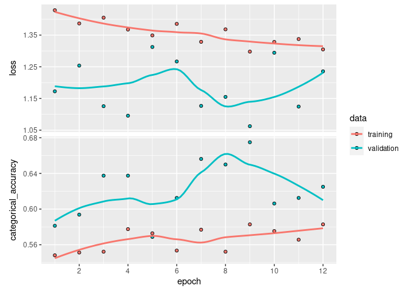

Efficient Net Application, fine tuning
================

# Fine tuning efficientnet with R

In this notebook we fine tune the model developed in the notebook
cassava\_application\_efficientnet.Rmd.

``` r
library(tidyverse)
```

    ## ── Attaching packages ─────────────────────────────────────── tidyverse 1.3.0 ──

    ## ✓ ggplot2 3.3.2     ✓ purrr   0.3.4
    ## ✓ tibble  3.0.4     ✓ dplyr   1.0.2
    ## ✓ tidyr   1.1.2     ✓ stringr 1.4.0
    ## ✓ readr   1.4.0     ✓ forcats 0.5.0

    ## ── Conflicts ────────────────────────────────────────── tidyverse_conflicts() ──
    ## x dplyr::filter() masks stats::filter()
    ## x dplyr::lag()    masks stats::lag()

``` r
library(tensorflow)
tf$executing_eagerly()
```

    ## [1] TRUE

``` r
#devtools::install_github(repo="Cdk29/keras")
```

``` r
library(keras)
#library(reticulate)
```

``` r
#tfhub::install_tfhub()
```

``` r
#reticulate::py_install(c("Pillow"), pip = TRUE)
#reticulate::py_install(c("tensorflow_hub"), pip = TRUE)
library(tfhub)
```

``` r
tensorflow::tf_version()
```

    ## [1] '2.3'

``` r
tfhub:::tfhub$version$`__version__`
```

    ## [1] "0.10.0"

``` r
labels<-read_csv('cassava-leaf-disease-classification/train.csv')
```

    ## 
    ## ── Column specification ────────────────────────────────────────────────────────
    ## cols(
    ##   image_id = col_character(),
    ##   label = col_double()
    ## )

``` r
head(labels)
```

    ## # A tibble: 6 x 2
    ##   image_id       label
    ##   <chr>          <dbl>
    ## 1 1000015157.jpg     0
    ## 2 1000201771.jpg     3
    ## 3 100042118.jpg      1
    ## 4 1000723321.jpg     1
    ## 5 1000812911.jpg     3
    ## 6 1000837476.jpg     3

``` r
levels(as.factor(labels$label))
```

    ## [1] "0" "1" "2" "3" "4"

``` r
idx0<-which(labels$label==0)
idx1<-which(labels$label==1)
idx2<-which(labels$label==2)
idx3<-which(labels$label==3)
idx4<-which(labels$label==4)
```

``` r
labels$CBB<-0
labels$CBSD<-0
labels$CGM<-0
labels$CMD<-0
labels$Healthy<-0
```

``` r
labels$CBB[idx0]<-1
labels$CBSD[idx1]<-1
labels$CGM[idx2]<-1
labels$CMD[idx3]<-1
labels$Healthy[idx4]<-1
```

``` r
#labels$label<-NULL
```

``` r
head(labels)
```

    ## # A tibble: 6 x 7
    ##   image_id       label   CBB  CBSD   CGM   CMD Healthy
    ##   <chr>          <dbl> <dbl> <dbl> <dbl> <dbl>   <dbl>
    ## 1 1000015157.jpg     0     1     0     0     0       0
    ## 2 1000201771.jpg     3     0     0     0     1       0
    ## 3 100042118.jpg      1     0     1     0     0       0
    ## 4 1000723321.jpg     1     0     1     0     0       0
    ## 5 1000812911.jpg     3     0     0     0     1       0
    ## 6 1000837476.jpg     3     0     0     0     1       0

``` r
set.seed(6)

tmp = splitstackshape::stratified(labels, c('label'), 0.9, bothSets = TRUE)

train_labels = tmp[[1]]
val_labels = tmp[[2]]

train_labels$label<-NULL
val_labels$label<-NULL

head(train_labels)
```

    ##          image_id CBB CBSD CGM CMD Healthy
    ## 1: 3903787097.jpg   1    0   0   0       0
    ## 2: 1026467332.jpg   1    0   0   0       0
    ## 3:  436868168.jpg   1    0   0   0       0
    ## 4: 2270851426.jpg   1    0   0   0       0
    ## 5: 3234915269.jpg   1    0   0   0       0
    ## 6: 3950368220.jpg   1    0   0   0       0

``` r
head(val_labels)
```

    ##          image_id CBB CBSD CGM CMD Healthy
    ## 1: 1003442061.jpg   0    0   0   0       1
    ## 2: 1004672608.jpg   0    0   0   1       0
    ## 3: 1007891044.jpg   0    0   0   1       0
    ## 4: 1009845426.jpg   0    0   0   1       0
    ## 5: 1010648150.jpg   0    0   0   1       0
    ## 6: 1011139244.jpg   0    0   0   1       0

``` r
summary(train_labels)
```

    ##    image_id              CBB               CBSD             CGM        
    ##  Length:19256       Min.   :0.00000   Min.   :0.0000   Min.   :0.0000  
    ##  Class :character   1st Qu.:0.00000   1st Qu.:0.0000   1st Qu.:0.0000  
    ##  Mode  :character   Median :0.00000   Median :0.0000   Median :0.0000  
    ##                     Mean   :0.05079   Mean   :0.1023   Mean   :0.1115  
    ##                     3rd Qu.:0.00000   3rd Qu.:0.0000   3rd Qu.:0.0000  
    ##                     Max.   :1.00000   Max.   :1.0000   Max.   :1.0000  
    ##       CMD           Healthy      
    ##  Min.   :0.000   Min.   :0.0000  
    ##  1st Qu.:0.000   1st Qu.:0.0000  
    ##  Median :1.000   Median :0.0000  
    ##  Mean   :0.615   Mean   :0.1204  
    ##  3rd Qu.:1.000   3rd Qu.:0.0000  
    ##  Max.   :1.000   Max.   :1.0000

``` r
summary(val_labels)
```

    ##    image_id              CBB               CBSD             CGM        
    ##  Length:2141        Min.   :0.00000   Min.   :0.0000   Min.   :0.0000  
    ##  Class :character   1st Qu.:0.00000   1st Qu.:0.0000   1st Qu.:0.0000  
    ##  Mode  :character   Median :0.00000   Median :0.0000   Median :0.0000  
    ##                     Mean   :0.05091   Mean   :0.1023   Mean   :0.1116  
    ##                     3rd Qu.:0.00000   3rd Qu.:0.0000   3rd Qu.:0.0000  
    ##                     Max.   :1.00000   Max.   :1.0000   Max.   :1.0000  
    ##       CMD            Healthy      
    ##  Min.   :0.0000   Min.   :0.0000  
    ##  1st Qu.:0.0000   1st Qu.:0.0000  
    ##  Median :1.0000   Median :0.0000  
    ##  Mean   :0.6147   Mean   :0.1205  
    ##  3rd Qu.:1.0000   3rd Qu.:0.0000  
    ##  Max.   :1.0000   Max.   :1.0000

``` r
image_path<-'cassava-leaf-disease-classification/train_images/'
```

``` r
#data augmentation
datagen <- image_data_generator(
  rotation_range = 40,
  width_shift_range = 0.2,
  height_shift_range = 0.2,
  shear_range = 0.2,
  zoom_range = 0.5,
  horizontal_flip = TRUE,
  fill_mode = "reflect"
)
```

``` r
img_path<-"cassava-leaf-disease-classification/train_images/1000015157.jpg"

img <- image_load(img_path, target_size = c(448, 448))
img_array <- image_to_array(img)
img_array <- array_reshape(img_array, c(1, 448, 448, 3))
img_array<-img_array/255
# Generated that will flow augmented images
augmentation_generator <- flow_images_from_data(
  img_array, 
  generator = datagen, 
  batch_size = 1 
)
op <- par(mfrow = c(2, 2), pty = "s", mar = c(1, 0, 1, 0))
for (i in 1:4) {
  batch <- generator_next(augmentation_generator)
  plot(as.raster(batch[1,,,]))
}
```

<!-- -->

``` r
par(op)
```

``` r
train_generator <- flow_images_from_dataframe(dataframe = train_labels, 
                                              directory = image_path,
                                              generator = datagen,
                                              class_mode = "other",
                                              x_col = "image_id",
                                              y_col = c("CBB","CBSD", "CGM", "CMD", "Healthy"),
                                              target_size = c(448, 448),
                                              batch_size=8)

validation_generator <- flow_images_from_dataframe(dataframe = val_labels, 
                                              directory = image_path,
                                              class_mode = "other",
                                              x_col = "image_id",
                                              y_col = c("CBB","CBSD", "CGM", "CMD", "Healthy"),
                                              target_size = c(448, 448),
                                              batch_size=8)
```

``` r
train_generator
```

    ## <tensorflow.python.keras.preprocessing.image.DataFrameIterator>

``` r
conv_base<-application_inception_resnet_v2(weights = "imagenet", include_top = FALSE, input_shape = c(448, 448, 3))
```

``` r
freeze_weights(conv_base)
```

``` r
model <- keras_model_sequential() %>%
    conv_base %>% 
    layer_global_max_pooling_2d() %>% 
    layer_batch_normalization() %>% 
    layer_dropout(rate=0.5) %>%
    layer_dense(units=5, activation="softmax")
```

``` r
summary(model)
```

    ## Model: "sequential"
    ## ________________________________________________________________________________
    ## Layer (type)                        Output Shape                    Param #     
    ## ================================================================================
    ## inception_resnet_v2 (Functional)    (None, 12, 12, 1536)            54336736    
    ## ________________________________________________________________________________
    ## global_max_pooling2d (GlobalMaxPool (None, 1536)                    0           
    ## ________________________________________________________________________________
    ## batch_normalization_203 (BatchNorma (None, 1536)                    6144        
    ## ________________________________________________________________________________
    ## dropout (Dropout)                   (None, 1536)                    0           
    ## ________________________________________________________________________________
    ## dense (Dense)                       (None, 5)                       7685        
    ## ================================================================================
    ## Total params: 54,350,565
    ## Trainable params: 10,757
    ## Non-trainable params: 54,339,808
    ## ________________________________________________________________________________

``` r
checkpoint_dir <- "checkpoints"
model %>% load_model_weights_hdf5("checkpoints/fine_tuned_resnetv2.07.hdf5")
```

``` r
#summary(conv_base)
```

``` r
#first at 26 x 26 
unfreeze_weights(conv_base, from ="conv2d_275")
```

``` r
callback_lr_init <- function(logs){
      iter <<- 0
      lr_hist <<- c()
      iter_hist <<- c()
}
callback_lr_set <- function(batch, logs){
      iter <<- iter + 1
      LR <- l_rate[iter] # if number of iterations > l_rate values, make LR constant to last value
      if(is.na(LR)) LR <- l_rate[length(l_rate)]
      k_set_value(model$optimizer$lr, LR)
}

callback_lr <- callback_lambda(on_train_begin=callback_lr_init, on_batch_begin=callback_lr_set)
```

``` r
####################
Cyclic_LR <- function(iteration=1:32000, base_lr=1e-5, max_lr=1e-3, step_size=2000, mode='triangular', gamma=1, scale_fn=NULL, scale_mode='cycle'){ # translated from python to R, original at: https://github.com/bckenstler/CLR/blob/master/clr_callback.py # This callback implements a cyclical learning rate policy (CLR). # The method cycles the learning rate between two boundaries with # some constant frequency, as detailed in this paper (https://arxiv.org/abs/1506.01186). # The amplitude of the cycle can be scaled on a per-iteration or per-cycle basis. # This class has three built-in policies, as put forth in the paper. # - "triangular": A basic triangular cycle w/ no amplitude scaling. # - "triangular2": A basic triangular cycle that scales initial amplitude by half each cycle. # - "exp_range": A cycle that scales initial amplitude by gamma**(cycle iterations) at each cycle iteration. # - "sinus": A sinusoidal form cycle # # Example # > clr <- Cyclic_LR(base_lr=0.001, max_lr=0.006, step_size=2000, mode='triangular', num_iterations=20000) # > plot(clr, cex=0.2)
 
      # Class also supports custom scaling functions with function output max value of 1:
      # > clr_fn <- function(x) 1/x # > clr <- Cyclic_LR(base_lr=0.001, max_lr=0.006, step_size=400, # scale_fn=clr_fn, scale_mode='cycle', num_iterations=20000) # > plot(clr, cex=0.2)
 
      # # Arguments
      #   iteration:
      #       if is a number:
      #           id of the iteration where: max iteration = epochs * (samples/batch)
      #       if "iteration" is a vector i.e.: iteration=1:10000:
      #           returns the whole sequence of lr as a vector
      #   base_lr: initial learning rate which is the
      #       lower boundary in the cycle.
      #   max_lr: upper boundary in the cycle. Functionally,
      #       it defines the cycle amplitude (max_lr - base_lr).
      #       The lr at any cycle is the sum of base_lr
      #       and some scaling of the amplitude; therefore 
      #       max_lr may not actually be reached depending on
      #       scaling function.
      #   step_size: number of training iterations per
      #       half cycle. Authors suggest setting step_size
      #       2-8 x training iterations in epoch.
      #   mode: one of {triangular, triangular2, exp_range, sinus}.
      #       Default 'triangular'.
      #       Values correspond to policies detailed above.
      #       If scale_fn is not None, this argument is ignored.
      #   gamma: constant in 'exp_range' scaling function:
      #       gamma**(cycle iterations)
      #   scale_fn: Custom scaling policy defined by a single
      #       argument lambda function, where 
      #       0 <= scale_fn(x) <= 1 for all x >= 0.
      #       mode paramater is ignored 
      #   scale_mode: {'cycle', 'iterations'}.
      #       Defines whether scale_fn is evaluated on 
      #       cycle number or cycle iterations (training
      #       iterations since start of cycle). Default is 'cycle'.
 
      ########
      if(is.null(scale_fn)==TRUE){
            if(mode=='triangular'){scale_fn <- function(x) 1; scale_mode <- 'cycle';}
            if(mode=='triangular2'){scale_fn <- function(x) 1/(2^(x-1)); scale_mode <- 'cycle';}
            if(mode=='exp_range'){scale_fn <- function(x) gamma^(x); scale_mode <- 'iterations';}
            if(mode=='sinus'){scale_fn <- function(x) 0.5*(1+sin(x*pi/2)); scale_mode <- 'cycle';}
            if(mode=='halfcosine'){scale_fn <- function(x) 0.5*(1+cos(x*pi)^2); scale_mode <- 'cycle';}
      }
      lr <- list()
      if(is.vector(iteration)==TRUE){
            for(iter in iteration){
                  cycle <- floor(1 + (iter / (2*step_size)))
                  x2 <- abs(iter/step_size-2 * cycle+1)
                  if(scale_mode=='cycle') x <- cycle
                  if(scale_mode=='iterations') x <- iter
                  lr[[iter]] <- base_lr + (max_lr-base_lr) * max(0,(1-x2)) * scale_fn(x)
            }
      }
      lr <- do.call("rbind",lr)
      return(as.vector(lr))
}
```

``` r
n=400
nb_epochs=12
#n_iter<-n*nb_epochs
```

Okay, what is going on here ? Simple speaking I want the last steps to
go several order of magnitude under the minimal learning rate, in a
similar fashion to the fast.ai implementation. The most elegant way to
do this is to divide the learning rate of the last steps by a number
growing exponentially (to avoid a cut in the learning rate curve). So we
have a nice “tail” (see graphs below).

Oh there is no specific justifications for the exponent number. Just
trial and error.

``` r
tail <- 30 #annhilation of the gradient
i<-1:tail
l_rate_div<-1.1*(1.2^i) #formula from the blog article of fastai.
plot(l_rate_div, type="b", pch=16, cex=0.1, xlab="iteration", ylab="learning rate dividor")
```

<!-- -->

``` r
l_rate_cyclical <- Cyclic_LR(iteration=1:n, base_lr=1e-7, max_lr=(1e-3/5), step_size=floor(n/2),
                        mode='triangular', gamma=1, scale_fn=NULL, scale_mode='cycle')

start_tail <-length(l_rate_cyclical)-tail
end_tail <- length(l_rate_cyclical)
l_rate_cyclical[start_tail:end_tail] <- l_rate_cyclical[start_tail:end_tail]/l_rate_div
```

    ## Warning in l_rate_cyclical[start_tail:end_tail]/l_rate_div: la taille d'un objet
    ## plus long n'est pas multiple de la taille d'un objet plus court

``` r
l_rate <- rep(l_rate_cyclical, nb_epochs)

plot(l_rate_cyclical, type="b", pch=16, xlab="iteration", cex=0.2, ylab="learning rate", col="grey50")
```

<!-- -->

``` r
plot(l_rate, type="b", pch=16, xlab="iteration", cex=0.2, ylab="learning rate", col="grey50")
```

<!-- -->

``` r
model %>% compile(
    optimizer=optimizer_rmsprop(lr=1e-5),
    loss="categorical_crossentropy",
    metrics = "categorical_accuracy"
)
```

The following code came from the tutorial of Keras
“tutorial\_save\_and\_restore”.

``` r
checkpoint_dir <- "checkpoints_fine_tune"
unlink(checkpoint_dir, recursive = TRUE)
dir.create(checkpoint_dir)
filepath <- file.path(checkpoint_dir, "inception_resnet.{epoch:02d}.hdf5")
```

``` r
check_point_callback <- callback_model_checkpoint(
  filepath = filepath,
  save_weights_only = TRUE,
  save_best_only = TRUE
)
```

``` r
callback_list<-list(callback_lr, check_point_callback ) #callback to update lr
```

``` r
history <- model %>% fit_generator(
    train_generator,
    steps_per_epoch=n,
    epochs = nb_epochs,
    callbacks = callback_list, #callback to update cylic lr
    validation_data = validation_generator,
    validation_step=20
)
```

``` r
plot(history)
```

    ## `geom_smooth()` using formula 'y ~ x'

<!-- -->
