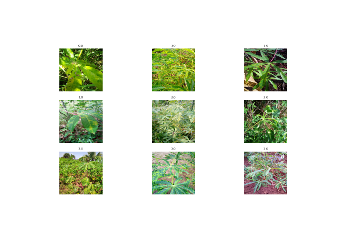
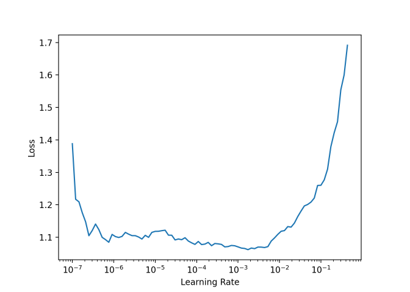

Lr finder dev notebook
================

# Resnext with R

Notebook to writte the freeze and unfreeze function for the fastai
wrapper.

``` r
# This R environment comes with many helpful analytics packages installed
# It is defined by the kaggle/rstats Docker image: https://github.com/kaggle/docker-rstats
# For example, here's a helpful package to load

library(tidyverse) # metapackage of all tidyverse packages
```

    ## ── Attaching packages ─────────────────────────────────────── tidyverse 1.3.0 ──

    ## ✓ ggplot2 3.3.2     ✓ purrr   0.3.4
    ## ✓ tibble  3.0.4     ✓ dplyr   1.0.2
    ## ✓ tidyr   1.1.2     ✓ stringr 1.4.0
    ## ✓ readr   1.4.0     ✓ forcats 0.5.0

    ## ── Conflicts ────────────────────────────────────────── tidyverse_conflicts() ──
    ## x dplyr::filter() masks stats::filter()
    ## x dplyr::lag()    masks stats::lag()

``` r
# Input data files are available in the read-only "../input/" directory
# For example, running this (by clicking run or pressing Shift+Enter) will list all files under the input directory

list.files(path = "../input")
```

    ## character(0)

``` r
#devtools::install_github("henry090/fastai",dependencies=FALSE)
#fastai::install_fastai(gpu = TRUE)
```

``` r
#fastai::install_fastai(gpu = TRUE)
```

``` r
library(fastai)
```

    ## 
    ## Attaching package: 'fastai'

    ## The following object is masked from 'package:dplyr':
    ## 
    ##     slice

    ## The following object is masked from 'package:purrr':
    ## 
    ##     partial

    ## The following object is masked from 'package:stats':
    ## 
    ##     reshape

    ## The following object is masked from 'package:graphics':
    ## 
    ##     plot

    ## The following objects are masked from 'package:grDevices':
    ## 
    ##     cm, colors, rgb2hsv

    ## The following object is masked from 'package:methods':
    ## 
    ##     show

    ## The following objects are masked from 'package:base':
    ## 
    ##     plot, Recall

## Data loader

I am using this two ressources : [the documentation of
fastai](https://docs.fast.ai/vision.data.html#ImageDataLoaders.from_df)
and the [tutorial of the
wrapper](https://henry090.github.io/fastai/articles/basic_img_class.html).

``` r
path_img = 'cassava-leaf-disease-classification/train_images/'
```

``` r
#library(data.table)
```

``` r
labels<-read_csv('cassava-leaf-disease-classification//train.csv')
```

    ## 
    ## ── Column specification ────────────────────────────────────────────────────────
    ## cols(
    ##   image_id = col_character(),
    ##   label = col_double()
    ## )

``` r
head(labels)
```

    ## # A tibble: 6 x 2
    ##   image_id       label
    ##   <chr>          <dbl>
    ## 1 1000015157.jpg     0
    ## 2 1000201771.jpg     3
    ## 3 100042118.jpg      1
    ## 4 1000723321.jpg     1
    ## 5 1000812911.jpg     3
    ## 6 1000837476.jpg     3

``` r
dataloader <- fastai::ImageDataLoaders_from_df(df=labels, path=path_img, bs=64, seed=6, device = 'cuda', num_workers=0, item_tfms = RandomResizedCrop(224, min_scale=0.75))
```

num\_workers=0 is mandatory to not have the error “RuntimeError:
DataLoader worker (pid(s) 482) exited unexpectedly”.

``` r
dataloader %>% show_batch()
```

<!-- -->

If I had to bet, it is something related to kaggle/R environnement
asking to define paremeters, as it works well in [the
tutorial](https://henry090.github.io/fastai/articles/basic_img_class.html).

``` r
learnR <- dataloader %>% cnn_learner(xresnet18(), metrics = accuracy,  model_dir="fastai_model/") #prettier
```

``` r
#learnR %>% freeze()
#Error in freeze(.): could not find function "freeze"
```

### Control of the manipulation

``` r
learnR$freeze()
learnR$summary()
```

    ## epoch   train_loss   valid_loss   accuracy   time  
    ## ------  -----------  -----------  ---------  ------

    ## Sequential (Input shape: ['64 x 3 x 224 x 224'])
    ## ================================================================
    ## Layer (type)         Output Shape         Param #    Trainable 
    ## ================================================================
    ## Conv2d               64 x 32 x 112 x 112  864        False     
    ## ________________________________________________________________
    ## BatchNorm2d          64 x 32 x 112 x 112  64         True      
    ## ________________________________________________________________
    ## ReLU                 64 x 32 x 112 x 112  0          False     
    ## ________________________________________________________________
    ## Conv2d               64 x 32 x 112 x 112  9,216      False     
    ## ________________________________________________________________
    ## BatchNorm2d          64 x 32 x 112 x 112  64         True      
    ## ________________________________________________________________
    ## ReLU                 64 x 32 x 112 x 112  0          False     
    ## ________________________________________________________________
    ## Conv2d               64 x 64 x 112 x 112  18,432     False     
    ## ________________________________________________________________
    ## BatchNorm2d          64 x 64 x 112 x 112  128        True      
    ## ________________________________________________________________
    ## ReLU                 64 x 64 x 112 x 112  0          False     
    ## ________________________________________________________________
    ## MaxPool2d            64 x 64 x 56 x 56    0          False     
    ## ________________________________________________________________
    ## Conv2d               64 x 64 x 56 x 56    36,864     False     
    ## ________________________________________________________________
    ## BatchNorm2d          64 x 64 x 56 x 56    128        True      
    ## ________________________________________________________________
    ## ReLU                 64 x 64 x 56 x 56    0          False     
    ## ________________________________________________________________
    ## Conv2d               64 x 64 x 56 x 56    36,864     False     
    ## ________________________________________________________________
    ## BatchNorm2d          64 x 64 x 56 x 56    128        True      
    ## ________________________________________________________________
    ## Sequential           64 x 64 x 56 x 56    0          False     
    ## ________________________________________________________________
    ## ReLU                 64 x 64 x 56 x 56    0          False     
    ## ________________________________________________________________
    ## Conv2d               64 x 64 x 56 x 56    36,864     False     
    ## ________________________________________________________________
    ## BatchNorm2d          64 x 64 x 56 x 56    128        True      
    ## ________________________________________________________________
    ## ReLU                 64 x 64 x 56 x 56    0          False     
    ## ________________________________________________________________
    ## Conv2d               64 x 64 x 56 x 56    36,864     False     
    ## ________________________________________________________________
    ## BatchNorm2d          64 x 64 x 56 x 56    128        True      
    ## ________________________________________________________________
    ## Sequential           64 x 64 x 56 x 56    0          False     
    ## ________________________________________________________________
    ## ReLU                 64 x 64 x 56 x 56    0          False     
    ## ________________________________________________________________
    ## Conv2d               64 x 128 x 28 x 28   73,728     False     
    ## ________________________________________________________________
    ## BatchNorm2d          64 x 128 x 28 x 28   256        True      
    ## ________________________________________________________________
    ## ReLU                 64 x 128 x 28 x 28   0          False     
    ## ________________________________________________________________
    ## Conv2d               64 x 128 x 28 x 28   147,456    False     
    ## ________________________________________________________________
    ## BatchNorm2d          64 x 128 x 28 x 28   256        True      
    ## ________________________________________________________________
    ## AvgPool2d            64 x 64 x 28 x 28    0          False     
    ## ________________________________________________________________
    ## Conv2d               64 x 128 x 28 x 28   8,192      False     
    ## ________________________________________________________________
    ## BatchNorm2d          64 x 128 x 28 x 28   256        True      
    ## ________________________________________________________________
    ## ReLU                 64 x 128 x 28 x 28   0          False     
    ## ________________________________________________________________
    ## Conv2d               64 x 128 x 28 x 28   147,456    False     
    ## ________________________________________________________________
    ## BatchNorm2d          64 x 128 x 28 x 28   256        True      
    ## ________________________________________________________________
    ## ReLU                 64 x 128 x 28 x 28   0          False     
    ## ________________________________________________________________
    ## Conv2d               64 x 128 x 28 x 28   147,456    False     
    ## ________________________________________________________________
    ## BatchNorm2d          64 x 128 x 28 x 28   256        True      
    ## ________________________________________________________________
    ## Sequential           64 x 128 x 28 x 28   0          False     
    ## ________________________________________________________________
    ## ReLU                 64 x 128 x 28 x 28   0          False     
    ## ________________________________________________________________
    ## Conv2d               64 x 256 x 14 x 14   294,912    False     
    ## ________________________________________________________________
    ## BatchNorm2d          64 x 256 x 14 x 14   512        True      
    ## ________________________________________________________________
    ## ReLU                 64 x 256 x 14 x 14   0          False     
    ## ________________________________________________________________
    ## Conv2d               64 x 256 x 14 x 14   589,824    False     
    ## ________________________________________________________________
    ## BatchNorm2d          64 x 256 x 14 x 14   512        True      
    ## ________________________________________________________________
    ## AvgPool2d            64 x 128 x 14 x 14   0          False     
    ## ________________________________________________________________
    ## Conv2d               64 x 256 x 14 x 14   32,768     False     
    ## ________________________________________________________________
    ## BatchNorm2d          64 x 256 x 14 x 14   512        True      
    ## ________________________________________________________________
    ## ReLU                 64 x 256 x 14 x 14   0          False     
    ## ________________________________________________________________
    ## Conv2d               64 x 256 x 14 x 14   589,824    False     
    ## ________________________________________________________________
    ## BatchNorm2d          64 x 256 x 14 x 14   512        True      
    ## ________________________________________________________________
    ## ReLU                 64 x 256 x 14 x 14   0          False     
    ## ________________________________________________________________
    ## Conv2d               64 x 256 x 14 x 14   589,824    False     
    ## ________________________________________________________________
    ## BatchNorm2d          64 x 256 x 14 x 14   512        True      
    ## ________________________________________________________________
    ## Sequential           64 x 256 x 14 x 14   0          False     
    ## ________________________________________________________________
    ## ReLU                 64 x 256 x 14 x 14   0          False     
    ## ________________________________________________________________
    ## Conv2d               64 x 512 x 7 x 7     1,179,648  False     
    ## ________________________________________________________________
    ## BatchNorm2d          64 x 512 x 7 x 7     1,024      True      
    ## ________________________________________________________________
    ## ReLU                 64 x 512 x 7 x 7     0          False     
    ## ________________________________________________________________
    ## Conv2d               64 x 512 x 7 x 7     2,359,296  False     
    ## ________________________________________________________________
    ## BatchNorm2d          64 x 512 x 7 x 7     1,024      True      
    ## ________________________________________________________________
    ## AvgPool2d            64 x 256 x 7 x 7     0          False     
    ## ________________________________________________________________
    ## Conv2d               64 x 512 x 7 x 7     131,072    False     
    ## ________________________________________________________________
    ## BatchNorm2d          64 x 512 x 7 x 7     1,024      True      
    ## ________________________________________________________________
    ## ReLU                 64 x 512 x 7 x 7     0          False     
    ## ________________________________________________________________
    ## Conv2d               64 x 512 x 7 x 7     2,359,296  False     
    ## ________________________________________________________________
    ## BatchNorm2d          64 x 512 x 7 x 7     1,024      True      
    ## ________________________________________________________________
    ## ReLU                 64 x 512 x 7 x 7     0          False     
    ## ________________________________________________________________
    ## Conv2d               64 x 512 x 7 x 7     2,359,296  False     
    ## ________________________________________________________________
    ## BatchNorm2d          64 x 512 x 7 x 7     1,024      True      
    ## ________________________________________________________________
    ## Sequential           64 x 512 x 7 x 7     0          False     
    ## ________________________________________________________________
    ## ReLU                 64 x 512 x 7 x 7     0          False     
    ## ________________________________________________________________
    ## AdaptiveAvgPool2d    64 x 512 x 1 x 1     0          False     
    ## ________________________________________________________________
    ## AdaptiveMaxPool2d    64 x 512 x 1 x 1     0          False     
    ## ________________________________________________________________
    ## Flatten              64 x 1024            0          False     
    ## ________________________________________________________________
    ## BatchNorm1d          64 x 1024            2,048      True      
    ## ________________________________________________________________
    ## Dropout              64 x 1024            0          False     
    ## ________________________________________________________________
    ## Linear               64 x 512             524,288    True      
    ## ________________________________________________________________
    ## ReLU                 64 x 512             0          False     
    ## ________________________________________________________________
    ## BatchNorm1d          64 x 512             1,024      True      
    ## ________________________________________________________________
    ## Dropout              64 x 512             0          False     
    ## ________________________________________________________________
    ## Linear               64 x 5               2,560      True      
    ## ________________________________________________________________
    ## 
    ## Total params: 11,725,664
    ## Total trainable params: 539,648
    ## Total non-trainable params: 11,186,016
    ## 
    ## Optimizer used: <function Adam at 0x7ffa1b2a3378>
    ## Loss function: FlattenedLoss of CrossEntropyLoss()
    ## 
    ## Model frozen up to parameter group #2
    ## 
    ## Callbacks:
    ##   - TrainEvalCallback
    ##   - Recorder
    ##   - ProgressCallback

``` r
learnR$unfreeze()
learnR$summary()
```

    ## epoch   train_loss   valid_loss   accuracy   time  
    ## ------  -----------  -----------  ---------  ------

    ## Sequential (Input shape: ['64 x 3 x 224 x 224'])
    ## ================================================================
    ## Layer (type)         Output Shape         Param #    Trainable 
    ## ================================================================
    ## Conv2d               64 x 32 x 112 x 112  864        True      
    ## ________________________________________________________________
    ## BatchNorm2d          64 x 32 x 112 x 112  64         True      
    ## ________________________________________________________________
    ## ReLU                 64 x 32 x 112 x 112  0          False     
    ## ________________________________________________________________
    ## Conv2d               64 x 32 x 112 x 112  9,216      True      
    ## ________________________________________________________________
    ## BatchNorm2d          64 x 32 x 112 x 112  64         True      
    ## ________________________________________________________________
    ## ReLU                 64 x 32 x 112 x 112  0          False     
    ## ________________________________________________________________
    ## Conv2d               64 x 64 x 112 x 112  18,432     True      
    ## ________________________________________________________________
    ## BatchNorm2d          64 x 64 x 112 x 112  128        True      
    ## ________________________________________________________________
    ## ReLU                 64 x 64 x 112 x 112  0          False     
    ## ________________________________________________________________
    ## MaxPool2d            64 x 64 x 56 x 56    0          False     
    ## ________________________________________________________________
    ## Conv2d               64 x 64 x 56 x 56    36,864     True      
    ## ________________________________________________________________
    ## BatchNorm2d          64 x 64 x 56 x 56    128        True      
    ## ________________________________________________________________
    ## ReLU                 64 x 64 x 56 x 56    0          False     
    ## ________________________________________________________________
    ## Conv2d               64 x 64 x 56 x 56    36,864     True      
    ## ________________________________________________________________
    ## BatchNorm2d          64 x 64 x 56 x 56    128        True      
    ## ________________________________________________________________
    ## Sequential           64 x 64 x 56 x 56    0          False     
    ## ________________________________________________________________
    ## ReLU                 64 x 64 x 56 x 56    0          False     
    ## ________________________________________________________________
    ## Conv2d               64 x 64 x 56 x 56    36,864     True      
    ## ________________________________________________________________
    ## BatchNorm2d          64 x 64 x 56 x 56    128        True      
    ## ________________________________________________________________
    ## ReLU                 64 x 64 x 56 x 56    0          False     
    ## ________________________________________________________________
    ## Conv2d               64 x 64 x 56 x 56    36,864     True      
    ## ________________________________________________________________
    ## BatchNorm2d          64 x 64 x 56 x 56    128        True      
    ## ________________________________________________________________
    ## Sequential           64 x 64 x 56 x 56    0          False     
    ## ________________________________________________________________
    ## ReLU                 64 x 64 x 56 x 56    0          False     
    ## ________________________________________________________________
    ## Conv2d               64 x 128 x 28 x 28   73,728     True      
    ## ________________________________________________________________
    ## BatchNorm2d          64 x 128 x 28 x 28   256        True      
    ## ________________________________________________________________
    ## ReLU                 64 x 128 x 28 x 28   0          False     
    ## ________________________________________________________________
    ## Conv2d               64 x 128 x 28 x 28   147,456    True      
    ## ________________________________________________________________
    ## BatchNorm2d          64 x 128 x 28 x 28   256        True      
    ## ________________________________________________________________
    ## AvgPool2d            64 x 64 x 28 x 28    0          False     
    ## ________________________________________________________________
    ## Conv2d               64 x 128 x 28 x 28   8,192      True      
    ## ________________________________________________________________
    ## BatchNorm2d          64 x 128 x 28 x 28   256        True      
    ## ________________________________________________________________
    ## ReLU                 64 x 128 x 28 x 28   0          False     
    ## ________________________________________________________________
    ## Conv2d               64 x 128 x 28 x 28   147,456    True      
    ## ________________________________________________________________
    ## BatchNorm2d          64 x 128 x 28 x 28   256        True      
    ## ________________________________________________________________
    ## ReLU                 64 x 128 x 28 x 28   0          False     
    ## ________________________________________________________________
    ## Conv2d               64 x 128 x 28 x 28   147,456    True      
    ## ________________________________________________________________
    ## BatchNorm2d          64 x 128 x 28 x 28   256        True      
    ## ________________________________________________________________
    ## Sequential           64 x 128 x 28 x 28   0          False     
    ## ________________________________________________________________
    ## ReLU                 64 x 128 x 28 x 28   0          False     
    ## ________________________________________________________________
    ## Conv2d               64 x 256 x 14 x 14   294,912    True      
    ## ________________________________________________________________
    ## BatchNorm2d          64 x 256 x 14 x 14   512        True      
    ## ________________________________________________________________
    ## ReLU                 64 x 256 x 14 x 14   0          False     
    ## ________________________________________________________________
    ## Conv2d               64 x 256 x 14 x 14   589,824    True      
    ## ________________________________________________________________
    ## BatchNorm2d          64 x 256 x 14 x 14   512        True      
    ## ________________________________________________________________
    ## AvgPool2d            64 x 128 x 14 x 14   0          False     
    ## ________________________________________________________________
    ## Conv2d               64 x 256 x 14 x 14   32,768     True      
    ## ________________________________________________________________
    ## BatchNorm2d          64 x 256 x 14 x 14   512        True      
    ## ________________________________________________________________
    ## ReLU                 64 x 256 x 14 x 14   0          False     
    ## ________________________________________________________________
    ## Conv2d               64 x 256 x 14 x 14   589,824    True      
    ## ________________________________________________________________
    ## BatchNorm2d          64 x 256 x 14 x 14   512        True      
    ## ________________________________________________________________
    ## ReLU                 64 x 256 x 14 x 14   0          False     
    ## ________________________________________________________________
    ## Conv2d               64 x 256 x 14 x 14   589,824    True      
    ## ________________________________________________________________
    ## BatchNorm2d          64 x 256 x 14 x 14   512        True      
    ## ________________________________________________________________
    ## Sequential           64 x 256 x 14 x 14   0          False     
    ## ________________________________________________________________
    ## ReLU                 64 x 256 x 14 x 14   0          False     
    ## ________________________________________________________________
    ## Conv2d               64 x 512 x 7 x 7     1,179,648  True      
    ## ________________________________________________________________
    ## BatchNorm2d          64 x 512 x 7 x 7     1,024      True      
    ## ________________________________________________________________
    ## ReLU                 64 x 512 x 7 x 7     0          False     
    ## ________________________________________________________________
    ## Conv2d               64 x 512 x 7 x 7     2,359,296  True      
    ## ________________________________________________________________
    ## BatchNorm2d          64 x 512 x 7 x 7     1,024      True      
    ## ________________________________________________________________
    ## AvgPool2d            64 x 256 x 7 x 7     0          False     
    ## ________________________________________________________________
    ## Conv2d               64 x 512 x 7 x 7     131,072    True      
    ## ________________________________________________________________
    ## BatchNorm2d          64 x 512 x 7 x 7     1,024      True      
    ## ________________________________________________________________
    ## ReLU                 64 x 512 x 7 x 7     0          False     
    ## ________________________________________________________________
    ## Conv2d               64 x 512 x 7 x 7     2,359,296  True      
    ## ________________________________________________________________
    ## BatchNorm2d          64 x 512 x 7 x 7     1,024      True      
    ## ________________________________________________________________
    ## ReLU                 64 x 512 x 7 x 7     0          False     
    ## ________________________________________________________________
    ## Conv2d               64 x 512 x 7 x 7     2,359,296  True      
    ## ________________________________________________________________
    ## BatchNorm2d          64 x 512 x 7 x 7     1,024      True      
    ## ________________________________________________________________
    ## Sequential           64 x 512 x 7 x 7     0          False     
    ## ________________________________________________________________
    ## ReLU                 64 x 512 x 7 x 7     0          False     
    ## ________________________________________________________________
    ## AdaptiveAvgPool2d    64 x 512 x 1 x 1     0          False     
    ## ________________________________________________________________
    ## AdaptiveMaxPool2d    64 x 512 x 1 x 1     0          False     
    ## ________________________________________________________________
    ## Flatten              64 x 1024            0          False     
    ## ________________________________________________________________
    ## BatchNorm1d          64 x 1024            2,048      True      
    ## ________________________________________________________________
    ## Dropout              64 x 1024            0          False     
    ## ________________________________________________________________
    ## Linear               64 x 512             524,288    True      
    ## ________________________________________________________________
    ## ReLU                 64 x 512             0          False     
    ## ________________________________________________________________
    ## BatchNorm1d          64 x 512             1,024      True      
    ## ________________________________________________________________
    ## Dropout              64 x 512             0          False     
    ## ________________________________________________________________
    ## Linear               64 x 5               2,560      True      
    ## ________________________________________________________________
    ## 
    ## Total params: 11,725,664
    ## Total trainable params: 11,725,664
    ## Total non-trainable params: 0
    ## 
    ## Optimizer used: <function Adam at 0x7ffa1b2a3378>
    ## Loss function: FlattenedLoss of CrossEntropyLoss()
    ## 
    ## Model unfrozen
    ## 
    ## Callbacks:
    ##   - TrainEvalCallback
    ##   - Recorder
    ##   - ProgressCallback

### New functions

``` r
learnR %>% freeze()
```

    ## The model has been freezed

``` r
learnR$summary()
```

    ## epoch   train_loss   valid_loss   accuracy   time  
    ## ------  -----------  -----------  ---------  ------

    ## Sequential (Input shape: ['64 x 3 x 224 x 224'])
    ## ================================================================
    ## Layer (type)         Output Shape         Param #    Trainable 
    ## ================================================================
    ## Conv2d               64 x 32 x 112 x 112  864        False     
    ## ________________________________________________________________
    ## BatchNorm2d          64 x 32 x 112 x 112  64         True      
    ## ________________________________________________________________
    ## ReLU                 64 x 32 x 112 x 112  0          False     
    ## ________________________________________________________________
    ## Conv2d               64 x 32 x 112 x 112  9,216      False     
    ## ________________________________________________________________
    ## BatchNorm2d          64 x 32 x 112 x 112  64         True      
    ## ________________________________________________________________
    ## ReLU                 64 x 32 x 112 x 112  0          False     
    ## ________________________________________________________________
    ## Conv2d               64 x 64 x 112 x 112  18,432     False     
    ## ________________________________________________________________
    ## BatchNorm2d          64 x 64 x 112 x 112  128        True      
    ## ________________________________________________________________
    ## ReLU                 64 x 64 x 112 x 112  0          False     
    ## ________________________________________________________________
    ## MaxPool2d            64 x 64 x 56 x 56    0          False     
    ## ________________________________________________________________
    ## Conv2d               64 x 64 x 56 x 56    36,864     False     
    ## ________________________________________________________________
    ## BatchNorm2d          64 x 64 x 56 x 56    128        True      
    ## ________________________________________________________________
    ## ReLU                 64 x 64 x 56 x 56    0          False     
    ## ________________________________________________________________
    ## Conv2d               64 x 64 x 56 x 56    36,864     False     
    ## ________________________________________________________________
    ## BatchNorm2d          64 x 64 x 56 x 56    128        True      
    ## ________________________________________________________________
    ## Sequential           64 x 64 x 56 x 56    0          False     
    ## ________________________________________________________________
    ## ReLU                 64 x 64 x 56 x 56    0          False     
    ## ________________________________________________________________
    ## Conv2d               64 x 64 x 56 x 56    36,864     False     
    ## ________________________________________________________________
    ## BatchNorm2d          64 x 64 x 56 x 56    128        True      
    ## ________________________________________________________________
    ## ReLU                 64 x 64 x 56 x 56    0          False     
    ## ________________________________________________________________
    ## Conv2d               64 x 64 x 56 x 56    36,864     False     
    ## ________________________________________________________________
    ## BatchNorm2d          64 x 64 x 56 x 56    128        True      
    ## ________________________________________________________________
    ## Sequential           64 x 64 x 56 x 56    0          False     
    ## ________________________________________________________________
    ## ReLU                 64 x 64 x 56 x 56    0          False     
    ## ________________________________________________________________
    ## Conv2d               64 x 128 x 28 x 28   73,728     False     
    ## ________________________________________________________________
    ## BatchNorm2d          64 x 128 x 28 x 28   256        True      
    ## ________________________________________________________________
    ## ReLU                 64 x 128 x 28 x 28   0          False     
    ## ________________________________________________________________
    ## Conv2d               64 x 128 x 28 x 28   147,456    False     
    ## ________________________________________________________________
    ## BatchNorm2d          64 x 128 x 28 x 28   256        True      
    ## ________________________________________________________________
    ## AvgPool2d            64 x 64 x 28 x 28    0          False     
    ## ________________________________________________________________
    ## Conv2d               64 x 128 x 28 x 28   8,192      False     
    ## ________________________________________________________________
    ## BatchNorm2d          64 x 128 x 28 x 28   256        True      
    ## ________________________________________________________________
    ## ReLU                 64 x 128 x 28 x 28   0          False     
    ## ________________________________________________________________
    ## Conv2d               64 x 128 x 28 x 28   147,456    False     
    ## ________________________________________________________________
    ## BatchNorm2d          64 x 128 x 28 x 28   256        True      
    ## ________________________________________________________________
    ## ReLU                 64 x 128 x 28 x 28   0          False     
    ## ________________________________________________________________
    ## Conv2d               64 x 128 x 28 x 28   147,456    False     
    ## ________________________________________________________________
    ## BatchNorm2d          64 x 128 x 28 x 28   256        True      
    ## ________________________________________________________________
    ## Sequential           64 x 128 x 28 x 28   0          False     
    ## ________________________________________________________________
    ## ReLU                 64 x 128 x 28 x 28   0          False     
    ## ________________________________________________________________
    ## Conv2d               64 x 256 x 14 x 14   294,912    False     
    ## ________________________________________________________________
    ## BatchNorm2d          64 x 256 x 14 x 14   512        True      
    ## ________________________________________________________________
    ## ReLU                 64 x 256 x 14 x 14   0          False     
    ## ________________________________________________________________
    ## Conv2d               64 x 256 x 14 x 14   589,824    False     
    ## ________________________________________________________________
    ## BatchNorm2d          64 x 256 x 14 x 14   512        True      
    ## ________________________________________________________________
    ## AvgPool2d            64 x 128 x 14 x 14   0          False     
    ## ________________________________________________________________
    ## Conv2d               64 x 256 x 14 x 14   32,768     False     
    ## ________________________________________________________________
    ## BatchNorm2d          64 x 256 x 14 x 14   512        True      
    ## ________________________________________________________________
    ## ReLU                 64 x 256 x 14 x 14   0          False     
    ## ________________________________________________________________
    ## Conv2d               64 x 256 x 14 x 14   589,824    False     
    ## ________________________________________________________________
    ## BatchNorm2d          64 x 256 x 14 x 14   512        True      
    ## ________________________________________________________________
    ## ReLU                 64 x 256 x 14 x 14   0          False     
    ## ________________________________________________________________
    ## Conv2d               64 x 256 x 14 x 14   589,824    False     
    ## ________________________________________________________________
    ## BatchNorm2d          64 x 256 x 14 x 14   512        True      
    ## ________________________________________________________________
    ## Sequential           64 x 256 x 14 x 14   0          False     
    ## ________________________________________________________________
    ## ReLU                 64 x 256 x 14 x 14   0          False     
    ## ________________________________________________________________
    ## Conv2d               64 x 512 x 7 x 7     1,179,648  False     
    ## ________________________________________________________________
    ## BatchNorm2d          64 x 512 x 7 x 7     1,024      True      
    ## ________________________________________________________________
    ## ReLU                 64 x 512 x 7 x 7     0          False     
    ## ________________________________________________________________
    ## Conv2d               64 x 512 x 7 x 7     2,359,296  False     
    ## ________________________________________________________________
    ## BatchNorm2d          64 x 512 x 7 x 7     1,024      True      
    ## ________________________________________________________________
    ## AvgPool2d            64 x 256 x 7 x 7     0          False     
    ## ________________________________________________________________
    ## Conv2d               64 x 512 x 7 x 7     131,072    False     
    ## ________________________________________________________________
    ## BatchNorm2d          64 x 512 x 7 x 7     1,024      True      
    ## ________________________________________________________________
    ## ReLU                 64 x 512 x 7 x 7     0          False     
    ## ________________________________________________________________
    ## Conv2d               64 x 512 x 7 x 7     2,359,296  False     
    ## ________________________________________________________________
    ## BatchNorm2d          64 x 512 x 7 x 7     1,024      True      
    ## ________________________________________________________________
    ## ReLU                 64 x 512 x 7 x 7     0          False     
    ## ________________________________________________________________
    ## Conv2d               64 x 512 x 7 x 7     2,359,296  False     
    ## ________________________________________________________________
    ## BatchNorm2d          64 x 512 x 7 x 7     1,024      True      
    ## ________________________________________________________________
    ## Sequential           64 x 512 x 7 x 7     0          False     
    ## ________________________________________________________________
    ## ReLU                 64 x 512 x 7 x 7     0          False     
    ## ________________________________________________________________
    ## AdaptiveAvgPool2d    64 x 512 x 1 x 1     0          False     
    ## ________________________________________________________________
    ## AdaptiveMaxPool2d    64 x 512 x 1 x 1     0          False     
    ## ________________________________________________________________
    ## Flatten              64 x 1024            0          False     
    ## ________________________________________________________________
    ## BatchNorm1d          64 x 1024            2,048      True      
    ## ________________________________________________________________
    ## Dropout              64 x 1024            0          False     
    ## ________________________________________________________________
    ## Linear               64 x 512             524,288    True      
    ## ________________________________________________________________
    ## ReLU                 64 x 512             0          False     
    ## ________________________________________________________________
    ## BatchNorm1d          64 x 512             1,024      True      
    ## ________________________________________________________________
    ## Dropout              64 x 512             0          False     
    ## ________________________________________________________________
    ## Linear               64 x 5               2,560      True      
    ## ________________________________________________________________
    ## 
    ## Total params: 11,725,664
    ## Total trainable params: 539,648
    ## Total non-trainable params: 11,186,016
    ## 
    ## Optimizer used: <function Adam at 0x7ffa1b2a3378>
    ## Loss function: FlattenedLoss of CrossEntropyLoss()
    ## 
    ## Model frozen up to parameter group #2
    ## 
    ## Callbacks:
    ##   - TrainEvalCallback
    ##   - Recorder
    ##   - ProgressCallback

At the moment xresnet50() create out of memory errors.

``` r
learnR %>% lr_find()
```

    ## SuggestedLRs(lr_min=0.010000000149011612, lr_steep=1.0964781722577754e-06)

``` r
learnR %>% plot_lr_find(dpi = 200)
```

<!-- -->

``` r
learnR %>% fit_one_cycle(n_epoch = 6) 
```

    ## epoch   train_loss   valid_loss   accuracy   time  
    ## ------  -----------  -----------  ---------  ------
    ## 0       1.483974     0.990085     0.662071   03:32 
    ## 1       1.009283     0.801411     0.712082   03:31 
    ## 2       0.874470     0.738513     0.726805   03:33 
    ## 3       0.788658     0.700214     0.735219   03:31 
    ## 4       0.756062     0.678886     0.744567   03:31 
    ## 5       0.728166     0.676004     0.745501   03:30

``` r
learnR %>% unfreeze()
```

    ## The model has been unfreezed

``` r
learnR$summary()
```

    ## epoch   train_loss   valid_loss   accuracy   time 
    ## ------  -----------  -----------  ---------  -----

    ## Sequential (Input shape: ['64 x 3 x 224 x 224'])
    ## ================================================================
    ## Layer (type)         Output Shape         Param #    Trainable 
    ## ================================================================
    ## Conv2d               64 x 32 x 112 x 112  864        True      
    ## ________________________________________________________________
    ## BatchNorm2d          64 x 32 x 112 x 112  64         True      
    ## ________________________________________________________________
    ## ReLU                 64 x 32 x 112 x 112  0          False     
    ## ________________________________________________________________
    ## Conv2d               64 x 32 x 112 x 112  9,216      True      
    ## ________________________________________________________________
    ## BatchNorm2d          64 x 32 x 112 x 112  64         True      
    ## ________________________________________________________________
    ## ReLU                 64 x 32 x 112 x 112  0          False     
    ## ________________________________________________________________
    ## Conv2d               64 x 64 x 112 x 112  18,432     True      
    ## ________________________________________________________________
    ## BatchNorm2d          64 x 64 x 112 x 112  128        True      
    ## ________________________________________________________________
    ## ReLU                 64 x 64 x 112 x 112  0          False     
    ## ________________________________________________________________
    ## MaxPool2d            64 x 64 x 56 x 56    0          False     
    ## ________________________________________________________________
    ## Conv2d               64 x 64 x 56 x 56    36,864     True      
    ## ________________________________________________________________
    ## BatchNorm2d          64 x 64 x 56 x 56    128        True      
    ## ________________________________________________________________
    ## ReLU                 64 x 64 x 56 x 56    0          False     
    ## ________________________________________________________________
    ## Conv2d               64 x 64 x 56 x 56    36,864     True      
    ## ________________________________________________________________
    ## BatchNorm2d          64 x 64 x 56 x 56    128        True      
    ## ________________________________________________________________
    ## Sequential           64 x 64 x 56 x 56    0          False     
    ## ________________________________________________________________
    ## ReLU                 64 x 64 x 56 x 56    0          False     
    ## ________________________________________________________________
    ## Conv2d               64 x 64 x 56 x 56    36,864     True      
    ## ________________________________________________________________
    ## BatchNorm2d          64 x 64 x 56 x 56    128        True      
    ## ________________________________________________________________
    ## ReLU                 64 x 64 x 56 x 56    0          False     
    ## ________________________________________________________________
    ## Conv2d               64 x 64 x 56 x 56    36,864     True      
    ## ________________________________________________________________
    ## BatchNorm2d          64 x 64 x 56 x 56    128        True      
    ## ________________________________________________________________
    ## Sequential           64 x 64 x 56 x 56    0          False     
    ## ________________________________________________________________
    ## ReLU                 64 x 64 x 56 x 56    0          False     
    ## ________________________________________________________________
    ## Conv2d               64 x 128 x 28 x 28   73,728     True      
    ## ________________________________________________________________
    ## BatchNorm2d          64 x 128 x 28 x 28   256        True      
    ## ________________________________________________________________
    ## ReLU                 64 x 128 x 28 x 28   0          False     
    ## ________________________________________________________________
    ## Conv2d               64 x 128 x 28 x 28   147,456    True      
    ## ________________________________________________________________
    ## BatchNorm2d          64 x 128 x 28 x 28   256        True      
    ## ________________________________________________________________
    ## AvgPool2d            64 x 64 x 28 x 28    0          False     
    ## ________________________________________________________________
    ## Conv2d               64 x 128 x 28 x 28   8,192      True      
    ## ________________________________________________________________
    ## BatchNorm2d          64 x 128 x 28 x 28   256        True      
    ## ________________________________________________________________
    ## ReLU                 64 x 128 x 28 x 28   0          False     
    ## ________________________________________________________________
    ## Conv2d               64 x 128 x 28 x 28   147,456    True      
    ## ________________________________________________________________
    ## BatchNorm2d          64 x 128 x 28 x 28   256        True      
    ## ________________________________________________________________
    ## ReLU                 64 x 128 x 28 x 28   0          False     
    ## ________________________________________________________________
    ## Conv2d               64 x 128 x 28 x 28   147,456    True      
    ## ________________________________________________________________
    ## BatchNorm2d          64 x 128 x 28 x 28   256        True      
    ## ________________________________________________________________
    ## Sequential           64 x 128 x 28 x 28   0          False     
    ## ________________________________________________________________
    ## ReLU                 64 x 128 x 28 x 28   0          False     
    ## ________________________________________________________________
    ## Conv2d               64 x 256 x 14 x 14   294,912    True      
    ## ________________________________________________________________
    ## BatchNorm2d          64 x 256 x 14 x 14   512        True      
    ## ________________________________________________________________
    ## ReLU                 64 x 256 x 14 x 14   0          False     
    ## ________________________________________________________________
    ## Conv2d               64 x 256 x 14 x 14   589,824    True      
    ## ________________________________________________________________
    ## BatchNorm2d          64 x 256 x 14 x 14   512        True      
    ## ________________________________________________________________
    ## AvgPool2d            64 x 128 x 14 x 14   0          False     
    ## ________________________________________________________________
    ## Conv2d               64 x 256 x 14 x 14   32,768     True      
    ## ________________________________________________________________
    ## BatchNorm2d          64 x 256 x 14 x 14   512        True      
    ## ________________________________________________________________
    ## ReLU                 64 x 256 x 14 x 14   0          False     
    ## ________________________________________________________________
    ## Conv2d               64 x 256 x 14 x 14   589,824    True      
    ## ________________________________________________________________
    ## BatchNorm2d          64 x 256 x 14 x 14   512        True      
    ## ________________________________________________________________
    ## ReLU                 64 x 256 x 14 x 14   0          False     
    ## ________________________________________________________________
    ## Conv2d               64 x 256 x 14 x 14   589,824    True      
    ## ________________________________________________________________
    ## BatchNorm2d          64 x 256 x 14 x 14   512        True      
    ## ________________________________________________________________
    ## Sequential           64 x 256 x 14 x 14   0          False     
    ## ________________________________________________________________
    ## ReLU                 64 x 256 x 14 x 14   0          False     
    ## ________________________________________________________________
    ## Conv2d               64 x 512 x 7 x 7     1,179,648  True      
    ## ________________________________________________________________
    ## BatchNorm2d          64 x 512 x 7 x 7     1,024      True      
    ## ________________________________________________________________
    ## ReLU                 64 x 512 x 7 x 7     0          False     
    ## ________________________________________________________________
    ## Conv2d               64 x 512 x 7 x 7     2,359,296  True      
    ## ________________________________________________________________
    ## BatchNorm2d          64 x 512 x 7 x 7     1,024      True      
    ## ________________________________________________________________
    ## AvgPool2d            64 x 256 x 7 x 7     0          False     
    ## ________________________________________________________________
    ## Conv2d               64 x 512 x 7 x 7     131,072    True      
    ## ________________________________________________________________
    ## BatchNorm2d          64 x 512 x 7 x 7     1,024      True      
    ## ________________________________________________________________
    ## ReLU                 64 x 512 x 7 x 7     0          False     
    ## ________________________________________________________________
    ## Conv2d               64 x 512 x 7 x 7     2,359,296  True      
    ## ________________________________________________________________
    ## BatchNorm2d          64 x 512 x 7 x 7     1,024      True      
    ## ________________________________________________________________
    ## ReLU                 64 x 512 x 7 x 7     0          False     
    ## ________________________________________________________________
    ## Conv2d               64 x 512 x 7 x 7     2,359,296  True      
    ## ________________________________________________________________
    ## BatchNorm2d          64 x 512 x 7 x 7     1,024      True      
    ## ________________________________________________________________
    ## Sequential           64 x 512 x 7 x 7     0          False     
    ## ________________________________________________________________
    ## ReLU                 64 x 512 x 7 x 7     0          False     
    ## ________________________________________________________________
    ## AdaptiveAvgPool2d    64 x 512 x 1 x 1     0          False     
    ## ________________________________________________________________
    ## AdaptiveMaxPool2d    64 x 512 x 1 x 1     0          False     
    ## ________________________________________________________________
    ## Flatten              64 x 1024            0          False     
    ## ________________________________________________________________
    ## BatchNorm1d          64 x 1024            2,048      True      
    ## ________________________________________________________________
    ## Dropout              64 x 1024            0          False     
    ## ________________________________________________________________
    ## Linear               64 x 512             524,288    True      
    ## ________________________________________________________________
    ## ReLU                 64 x 512             0          False     
    ## ________________________________________________________________
    ## BatchNorm1d          64 x 512             1,024      True      
    ## ________________________________________________________________
    ## Dropout              64 x 512             0          False     
    ## ________________________________________________________________
    ## Linear               64 x 5               2,560      True      
    ## ________________________________________________________________
    ## 
    ## Total params: 11,725,664
    ## Total trainable params: 11,725,664
    ## Total non-trainable params: 0
    ## 
    ## Optimizer used: <function Adam at 0x7ffa1b2a3378>
    ## Loss function: FlattenedLoss of CrossEntropyLoss()
    ## 
    ## Model unfrozen
    ## 
    ## Callbacks:
    ##   - TrainEvalCallback
    ##   - Recorder
    ##   - ProgressCallback

``` r
learnR %>% lr_find()
```

    ## SuggestedLRs(lr_min=1.0964781722577755e-07, lr_steep=9.12010818865383e-07)

``` r
learnR %>% plot_lr_find(dpi = 200)
```

<!-- -->
