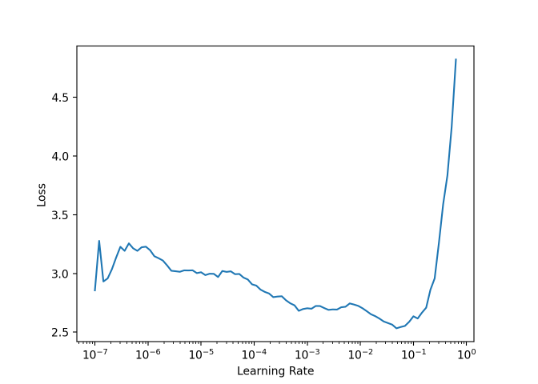

An R Markdown document converted from
trying-resnext-with-r-and-fastai.ipynb from kaggle
================

# Resnext with R

Resnexts and its derivative is one of the state of the art models for
computer vision and ensemble well with efficientnet, so it is normal for
me to try to train one. This kernal does not use keras. Two days ago I
broke my tensorflow set up on my personnal computer. Apparently trying
to uninstall and reinstall different version of keras to try to run the
resnext can create unexpected mess that required the use of my emergency
Ubuntu 20.10 pen drive to clean out.

**Spoiler alert :** it does not fully works and I hope this kernel will
help debug some aspect of the wrapper.

Since I did not find convenient way to implement a resnext using keras,
I will switch to fastai, which have implemented them since one year,
even if I did not noticed at the time, despite [commenting the
notebook](https://www.kaggle.com/jhoward/from-prototyping-to-submission-fastai).
In this kernel I use a wrapper of fastai that enthousiast me quite a
lot. Source material is <https://henry090.github.io/fastai> and
<https://www.kaggle.com/henry090/fast-ai-from-r-timm-learner>.

If you have seen my other kernels it should not come as a surprise than
I know fastai, since I reimplemented some kind of learning rate finder
and cyclical learning rate finder in keras. What about the submissions ?
Indeed, here we install a lot of things from internet. But a model
trained here can be load in a python kernel, so there is no big problem
about it, exept for using a Python kernel for the submission.

I found the wrapper quite tidious or frustrating to use sometimes,
reproducing perfectly the original user’s experience of fastai. So it is
quite a good job in that regards.

``` r
# This R environment comes with many helpful analytics packages installed
# It is defined by the kaggle/rstats Docker image: https://github.com/kaggle/docker-rstats
# For example, here's a helpful package to load

library(tidyverse) # metapackage of all tidyverse packages
```

    ## ── Attaching packages ─────────────────────────────────────── tidyverse 1.3.0 ──

    ## ✓ ggplot2 3.3.2     ✓ purrr   0.3.4
    ## ✓ tibble  3.0.4     ✓ dplyr   1.0.2
    ## ✓ tidyr   1.1.2     ✓ stringr 1.4.0
    ## ✓ readr   1.4.0     ✓ forcats 0.5.0

    ## ── Conflicts ────────────────────────────────────────── tidyverse_conflicts() ──
    ## x dplyr::filter() masks stats::filter()
    ## x dplyr::lag()    masks stats::lag()

``` r
# Input data files are available in the read-only "../input/" directory
# For example, running this (by clicking run or pressing Shift+Enter) will list all files under the input directory

list.files(path = "../input")
```

    ## character(0)

``` r
# You can write up to 20GB to the current directory (/kaggle/working/) that gets preserved as output when you create a version using "Save & Run All" 
# You can also write temporary files to /kaggle/temp/, but they won't be saved outside of the current session
```

``` r
devtools::install_github("henry090/fastai",dependencies=FALSE)
```

    ## Skipping install of 'fastai' from a github remote, the SHA1 (f6aaff0a) has not changed since last install.
    ##   Use `force = TRUE` to force installation

``` r
#fastai::install_fastai(gpu = TRUE)
```

``` r
#fastai::install_fastai(gpu = TRUE)
```

``` r
library(fastai)
```

    ## 
    ## Attaching package: 'fastai'

    ## The following object is masked from 'package:dplyr':
    ## 
    ##     slice

    ## The following object is masked from 'package:purrr':
    ## 
    ##     partial

    ## The following object is masked from 'package:stats':
    ## 
    ##     reshape

    ## The following object is masked from 'package:graphics':
    ## 
    ##     plot

    ## The following objects are masked from 'package:grDevices':
    ## 
    ##     cm, colors, rgb2hsv

    ## The following object is masked from 'package:methods':
    ## 
    ##     show

    ## The following objects are masked from 'package:base':
    ## 
    ##     plot, Recall

## Data loader

I am using this two ressources : [the documentation of
fastai](https://docs.fast.ai/vision.data.html#ImageDataLoaders.from_df)
and the [tutorial of the
wrapper](https://henry090.github.io/fastai/articles/basic_img_class.html).

``` r
path_img = 'cassava-leaf-disease-classification/train_images/'
```

``` r
#library(data.table)
```

``` r
labels<-read_csv('cassava-leaf-disease-classification//train.csv')
```

    ## 
    ## ── Column specification ────────────────────────────────────────────────────────
    ## cols(
    ##   image_id = col_character(),
    ##   label = col_double()
    ## )

``` r
#labels = data.table::fread('/kaggle/input/cassava-leaf-disease-classification//train.csv')
head(labels)
```

    ## # A tibble: 6 x 2
    ##   image_id       label
    ##   <chr>          <dbl>
    ## 1 1000015157.jpg     0
    ## 2 1000201771.jpg     3
    ## 3 100042118.jpg      1
    ## 4 1000723321.jpg     1
    ## 5 1000812911.jpg     3
    ## 6 1000837476.jpg     3

``` r
dataloader <- fastai::ImageDataLoaders_from_df(df=labels, path=path_img, bs=8, seed=6, device = 'cuda', num_workers=0, item_tfms = RandomResizedCrop(224, min_scale=0.75))
```

num\_workers=0 is mandatory to not have the error “RuntimeError:
DataLoader worker (pid(s) 482) exited unexpectedly”.

``` r
dataloader %>% show_batch()
```

<!-- -->

If I had to bet, it is something related to kaggle/R environnement
asking to define paremeters, as it works well in [the
tutorial](https://henry090.github.io/fastai/articles/basic_img_class.html).

``` r
learnR <- dataloader %>% cnn_learner(xresnet50(), metrics = accuracy,  model_dir="fastai_model/") #prettier
```

``` r
#learnR %>% freeze()
#Error in freeze(.): could not find function "freeze"
```

``` r
learnR$freeze()
```

Looking at the outputs of the kernel it does not seems to works (edit
version 19 : actually it works).

``` r
learnR %>% save(file="learnR")
```

``` r
#learnR$export() 
#"[Errno 30] Read-only file system: '../input/cassava-leaf-disease-classification/train_images/export.pkl" aahhh it brings back memories.
```

At the moment xresnet50() create out of memory errors.

``` r
learnR %>% lr_find()
```

    ## SuggestedLRs(lr_min=0.00010000000474974513, lr_steep=1.5848931980144698e-06)

``` r
#learnR$recorder$lrs
#learnR$recorder$losses
```

``` r
learnR %>% plot_lr_find(dpi = 200)
```

<!-- -->

Thanks for the plot.

``` r
#bss <- learnR %>% bs_find(lr=1e-3)

#learnR %>% plot_bs_find()
#Error in py_get_attr_impl(x, name, silent): AttributeError: 'Learner' object has no attribute 'bs_find'
```

``` r
#learnR$bs_find <- learnR %>% bs_find(lr=1e-3)

#learnR %>% plot_bs_find()
#Error in py_get_attr_impl(x, name, silent): AttributeError: 'Learner' object has no attribute 'bs_find'
```

``` r
#learnR$summary()
```

``` r
learnR %>% fit_one_cycle(n_epoch = 10) #works
```

    ## epoch   train_loss   valid_loss   accuracy   time  
    ## ------  -----------  -----------  ---------  ------
    ## 0       1.288910     0.884671     0.695490   05:34 
    ## 1       0.950516     0.843610     0.692218   05:21 
    ## 2       0.907325     0.673012     0.759290   05:18 
    ## 3       0.696161     0.667963     0.763029   05:19 
    ## 4       0.760623     0.612958     0.778920   05:19 
    ## 5       0.620131     0.608974     0.787333   05:18 
    ## 6       0.659987     0.574428     0.795279   05:18 
    ## 7       0.606033     0.559037     0.798551   05:19 
    ## 8       0.658417     0.544908     0.809068   05:19 
    ## 9       0.592561     0.549382     0.802057   05:18

``` r
#printing of the output?
```

``` r
interp <- ClassificationInterpretation_from_learner(learnR)

interp %>% plot_confusion_matrix(dpi =200,figsize = c(10,10))
```

<!-- -->

Well, there is some bug around and funny behaviors. That being said, it
is a wrapper, so it is normal to see weird things, and it is already a
lot of works. It is normal that there is not thousands of tutorial to
look after, you cannot think to everything before. And most of the
problems came from fastai it self, such as the num\_workers that you
have to set to zero if you don’t want the kernel to crash without
comprehensive error message or the mystical manipulation of the working
directory of the models I totally forgotten about before trying it
today.

Also, I/we can just use the wrapper on our personnal computer, but I
think it is not impossible to got all the outputs here on kaggle too.
